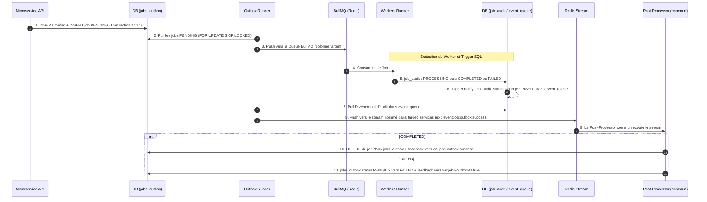

# C3 - Patterns & Flux Asynchrones

Ce document détaille le cœur de la machinerie de Volontariapp. C'est ici que la magie de la scalabilité opère. Si vous ne devez comprendre qu'un seul concept de toute la plateforme, c'est celui-ci : **Ne jamais bloquer une requête HTTP avec une tâche longue.**

## 1. Le Transactional Outbox Pattern (Le "Dual Write Problem")

Dans une architecture distribuée, que se passe-t-il si un Microservice enregistre un événement dans PostgreSQL, puis tente de publier un message dans Redis, mais que Redis crash juste à ce moment-là ? Le message est perdu, le système devient inconsistant. 

**Solution : Transaction ACID + Outbox.**
1. Le Microservice reçoit une requête (via gRPC depuis l'API Gateway).
2. Il ouvre une Transaction SQL.
3. Il insère les données métiers (ex: `INSERT INTO events`).
4. Dans **la même transaction**, il insère un "ticket" dans la table `jobs_outbox` (status : `PENDING`).
5. Il ferme la transaction (Commit). 
Si Postgres plante, rien n'est écrit. Si ça passe, les deux sont garantis d'être écrits. Le Microservice répond alors "OK" au Gateway.

**L'Outbox Runner** :
Un processus léger (`outbox-runners`) tourne en boucle infinie (Pull).
Il scrute la table `jobs_outbox` (`SELECT ... FOR UPDATE SKIP LOCKED` pour éviter les collisions entre plusieurs pods). Dès qu'il trouve un job `PENDING`, il le pousse vers une file Redis (BullMQ).

## 2. Le Cycle de Vie Complet d'un Job et le SQL Trigger

Que devient ce Job une fois dans Redis ? Voici le flux complet de bout-en-bout (Le *Audit Loop*) :



Grâce à ce cycle, un Job n'est effacé de la base d'origine que s'il a été traité jusqu'au bout et audité. Le `BaseWorker` (`@volontariapp/workers`) consulte aussi `job_audit` avant exécution : un job déjà `COMPLETED` n'est pas rejoué (garde d'idempotence).

> [!WARNING]
> **Bug connu (à corriger dans `@volontariapp/post-processors`)** : le trigger émet des événements de type `<domaine>:job:outbox:failure`, mais `JobOutboxFailedPostProcessor` (`packages/post-processors/src/common/job-outbox-failed.post-processor.ts`) ne traite que `job.outbox.failed` ou les types se terminant par `:job:outbox:failed`. Les échecs de jobs ne sont donc jamais traités : le job reste `PENDING` dans `jobs_outbox` et aucun feedback d'échec n'est émis.

### Schéma Technique des Tables & Déclencheurs SQL

Les 3 tables ci-dessous existent dans chaque base PostgreSQL de microservice. Elles sont créées par les migrations communes (`src/migrations/common/`), synchronisées entre services par `sync-migrations.sh`. Les statuts de `jobs_outbox` et `event_queue` suivent l'enum `OutboxStatus` (`@volontariapp/database`), ceux de `job_audit` l'enum `JobAuditStatus`.

#### 1. Table `jobs_outbox` (Stockage temporaire de la tâche)
| Colonne | Type | Description |
| :--- | :--- | :--- |
| `id` | `uuid` (PK) | Identifiant unique généré à l'insertion |
| `type` | `varchar(100)` | Type de job issu de `JobMessagingType` (ex : `post.publish_post`) |
| `emitter` | `varchar(100)` | Nom du microservice émetteur (ex : `ms-event`) |
| `emitterId` | `uuid` | Identifiant de l'initiateur |
| `target` | `varchar(100)` | Nom de la file BullMQ cible (ex : `events-queue`) |
| `payload` | `jsonb` | Données nécessaires à l'exécution de la tâche |
| `scheduled_at` | `timestamp` | Date d'exécution souhaitée |
| `status` | `varchar(20)` | `PENDING`, `PROCESSING`, `COMPLETED`, `FAILED` |
| `attempts` | `integer` | Nombre de tentatives de dispatch |
| `lastError` | `text` | Dernière erreur de dispatch |
| `traceId` | `uuid` | Identifiant de trace |
| `created_at` / `updated_at` | `timestamp` | Horodatages |

#### 2. Table `job_audit` (Traçabilité & Historique d'exécution)
| Colonne | Type | Description |
| :--- | :--- | :--- |
| `id` | `uuid` (PK) | Identifiant unique d'audit |
| `job_id` | `varchar(100)` (unique) | Référence vers `jobs_outbox.id` |
| `job_type` | `varchar(255)` | Type de job |
| `status` | `varchar(20)` | `PENDING`, `PROCESSING`, `COMPLETED`, `FAILED` |
| `worker_id` | `varchar(100)` | Worker qui a pris le job |
| `emitter` | `varchar(100)` | Microservice émetteur du job (sert de préfixe au stream de retour) |
| `current_attempt` | `integer` | Tentative courante |
| `result_payload` | `jsonb` | Résultat du handler (dont `originalPayload`) |
| `error_message` / `error_stack` | `text` | Erreur si `FAILED` |
| `started_at` / `finished_at` | `timestamp` | Début et fin d'exécution |
| `created_at` / `updated_at` | `timestamp` | Horodatages |

#### 3. Table `event_queue` (Événements distribués à propager)
| Colonne | Type | Description |
| :--- | :--- | :--- |
| `id` | `uuid` (PK) | Identifiant unique de l'événement |
| `type` | `varchar(100)` | Type issu de `EventMessagingType` (ex : `event.created`) |
| `emitter` | `varchar(100)` | Microservice émetteur |
| `emitterId` | `uuid` | Initiateur de l'événement |
| `target_services` | `varchar[]` | Streams Redis cibles (ex : `['event:created']`), valeurs de l'enum `Streams` (`@volontariapp/shared`) |
| `payload` | `jsonb` | Payload de l'événement |
| `version` | `integer` | Version du schéma de l'événement |
| `status` | `varchar(20)` | `PENDING`, `PROCESSING`, `COMPLETED`, `FAILED` |
| `attempts` / `lastError` | `integer` / `text` | Suivi des tentatives de publication |
| `correlation_id` | `uuid` | Corrélation (Scatter-Gather) |
| `traceId` | `uuid` | Identifiant de trace |
| `processed_at` | `timestamp` | Date de publication |
| `created_at` / `updated_at` | `timestamp` | Horodatages |

#### Le Trigger SQL Automatique (`job_audit_status_trigger`)

Version courante (migration commune `FixJobAuditTriggerTargetServices1781300000000`) :

```sql
CREATE OR REPLACE FUNCTION notify_job_audit_status_change()
RETURNS TRIGGER AS $$
DECLARE
  stream_prefix text;
  event_type text;
BEGIN
  stream_prefix := replace(NEW.emitter, 'ms-', '');
  IF NEW.status = 'COMPLETED' THEN
    event_type := stream_prefix || ':job:outbox:success';
    INSERT INTO event_queue (type, emitter, "emitterId", payload, version, updated_at, target_services)
    VALUES (
      event_type,
      NEW.emitter,
      NEW.job_id::uuid,
      jsonb_build_object('before', to_jsonb(OLD), 'after', to_jsonb(NEW)),
      1,
      now(),
      ARRAY[event_type]
    );
  ELSIF NEW.status = 'FAILED' THEN
    event_type := stream_prefix || ':job:outbox:failure';
    INSERT INTO event_queue (type, emitter, "emitterId", payload, version, updated_at, target_services)
    VALUES (
      event_type,
      NEW.emitter,
      NEW.job_id::uuid,
      jsonb_build_object('before', to_jsonb(OLD), 'after', to_jsonb(NEW)),
      1,
      now(),
      ARRAY[event_type]
    );
  END IF;
  RETURN NEW;
END;
$$ LANGUAGE plpgsql;

CREATE TRIGGER job_audit_status_trigger
AFTER UPDATE OF status ON job_audit
FOR EACH ROW
EXECUTE FUNCTION notify_job_audit_status_change();
```

Pour un job émis par `ms-event`, le type d'événement et le stream cible valent donc `event:job:outbox:success` ou `event:job:outbox:failure` (enum `Streams` : `EVENT_JOB_OUTBOX_SUCCESS`, `EVENT_JOB_OUTBOX_FAILURE`).


---

## 3. Le Pattern Scatter-Gather (Ex: Création d'un Événement)

Lorsqu'un utilisateur clique sur "Créer un Événement", le frontend affiche un état "Pending" (Spinner). Il ne recevra le feu vert (via WebSocket) que lorsque toutes les sous-tâches auront été accomplies par le backend. 

C'est le **Scatter-Gather**.

1. **Scatter (Éparpillement)** : `ms-event` crée l'événement et pousse un message sur le stream `event:created`.
2. Plusieurs Post-Processors (indépendants) écoutent ce même stream en parallèle :
   - Le `Post-Processor-Event` va géocoder l'adresse (appel d'une API de cartographie).
   - Le `Post-Processor-Social` va créer l'événement dans le graphe de la base Neo4j.
3. Chaque processeur publie son résultat de son côté sur le flux de feedback (`ws:event-created-feedback`) avec le même **Correlation_ID**.
4. **Gather (Rassemblement)** : Le `ws-service` écoute ces feedbacks. Il sait par configuration qu'il doit attendre **2 réponses** pour cet ID. 
   - Il stocke temporairement l'état dans Redis via `GatherStateService` (clé: `gather:<correlation_id>` avec un TTL de 60s).
   - Dès qu'il reçoit `2/2`, il envoie la notification WebSocket de succès (Done) au Frontend.

### Et en cas d'erreur ? (Gestion des Sagas)

Que se passe-t-il si la création dans Neo4j (`ms-social`) réussit, mais que le géocodage (`ms-event`) échoue (ex: Adresse introuvable ou timeout) ?

L'architecture déclenche un flux compensatoire (Compensation Saga) :
1. Le Post-Processor du géocodage émet un événement `EVENT_FAILED` sur le stream.
2. Le `ws-service` rassemble le feedback et constate l'échec. Il notifie immédiatement le client WebSocket avec l'erreur.
3. En parallèle, les autres Post-Processors écoutent le stream d'erreur. Le `Post-Processor-Social` capte cet échec et va **supprimer pro-activement** l'événement orphelin dans Neo4j (Rollback logique).

> [!TIP]
> **Pourquoi le WS-Service écoute-t-il directement les Streams ?**
> Plutôt que de forcer chaque microservice à faire un appel HTTP vers le Gateway ou le WS-Service pour dire "Mon job est fini", on utilise une approche Event-Driven pure. Le WS-Service est autonome et passif ; il observe les bus d'événements et informe le client, court-circuitant l'API Gateway.

