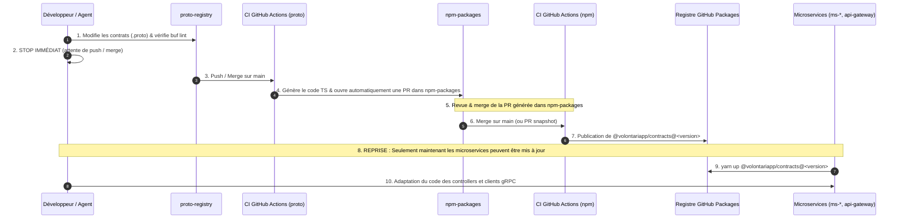

# Structure du Monorepo (NPM Packages)

L'architecture microservices de Volontariapp pose un défi majeur : comment partager du code métier (ex: le typage d'un Événement, la logique de validation, les algorithmes de filtrage) entre le `ms-event`, l'`outbox-event` et le `post-processor-event` sans dupliquer ce code dans 3 dépôts différents ?

La solution retenue est le **Monorepo central** hébergé dans le dépôt [**npm-packages**](https://github.com/Volontariapp/npm-packages).

## La Mutualisation par "Domaine"

Dans le diagramme de l'Image 4, le composant `DOMAIN_NPM` est classé dans la zone **PARTAGER (Shared)** de l'infrastructure. 
Il contient des packages métier (ex: `@volontariapp/domain-event`) qui encapsulent toute l'intelligence fonctionnelle.

### Qu'est-ce qu'un "Domain Package" ?
Un package de domaine (ex: `packages/domain-event`) n'est pas un serveur, il ne tourne pas. C'est une bibliothèque pure (Node.js/TypeScript) qui définit :
- Les **Entités** (ex: la classe `Event`).
- Les **Value Objects** (ex: `EventId`, `Location`).
- Les **Services Métier** (Logique métier pure, ex: `CalculateEventDistanceService`).
- Les **Repositories Abstraits** (Interfaces, implémentées ensuite par TypeORM dans les runners).

### Comment est-il consommé ?
Le Microservice (API) et les Runners (Outbox, Workers, Post-Processors) d'un même domaine installent ce package comme une simple dépendance via `yarn` (ex: `yarn add @volontariapp/domain-event`).

**Avantages :**
- **DRY (Don't Repeat Yourself)** : La logique de validation d'un champ ou de calcul n'est écrite qu'une seule fois.
- **Cohérence** : Les Workers d'arrière-plan utilisent rigoureusement les mêmes structures de données que le Microservice API. Si un champ est ajouté à une entité, TypeScript garantit que toutes les briques de la chaîne asynchrone s'alignent.

## Structure du Dépôt `npm-packages`

Ce dépôt contient également tous les utilitaires transverses du framework de Volontariapp :

```text
npm-packages/
├── packages/
│   ├── auth/              # Logique d'authentification (Tokens, Hachage)
│   ├── bridge/            # Couche d'accès DB optimisée
│   ├── config/            # Système de configuration centralisé (Env vars)
│   ├── contracts/         # Typages partagés et définitions de files BullMQ
│   ├── database/          # Utilitaires PostgreSQL / Neo4j
│   ├── domain-event/      # Intelligence fonctionnelle du domaine Event
│   ├── domain-social/     # Intelligence fonctionnelle du domaine Social
│   ├── domain-user/       # Intelligence fonctionnelle du domaine User
│   ├── errors/            # Registre centralisé des erreurs (Codes HTTP/gRPC)
│   ├── logger/            # Wrapper Winston pour la centralisation des logs
│   ├── messaging/         # Classes pour BullMQ / Redis Streams
│   ├── outbox/            # Le cœur du pattern Transactional Outbox (Polling, Retry)
│   ├── post-processors/   # Mécanismes de Circuit Breaker et DLQ
│   ├── shared/            # Utilitaires globaux (Dates, Arrays, Utils)
│   └── workers/           # Classes de base pour les Background Jobs (Audit)
└── ci-tools/              # Sous-module Git pour le outillage CI/CD et l'infra locale
```

## Couplage Modéré (Trade-off)

- En théorie puriste des Microservices, le partage de code est parfois déconseillé (principe du "Shared Nothing") pour éviter qu'une modification d'une librairie ne casse tous les services.
- **Le Compromis Volontariapp** : Le code partagé est limité à l'intérieur de **frontières bien définies**. Le `ms-user` n'utilise pas le `@volontariapp/domain-event`. Le partage s'effectue verticalement (API -> Worker -> Post-Processor d'un même domaine) plutôt qu'horizontalement. Quant aux librairies techniques (`@volontariapp/outbox`), elles s'apparentent à un framework interne d'entreprise, versionné et testé rigoureusement.

---

## Le Cycle de Propagation CI/CD & La Règle du Stop Immédiat

Dans une architecture distribuée multi-repo, la gestion des dépendances partagées exige une discipline de fer. Il est formellement interdit de modifier un consommateur (`ms-*`, `api-gateway`, runners) tant que la version amont du paquet n'a pas été effectivement compilée et publiée par la CI.

### 1. La Cascade depuis `proto-registry` (Contrats gRPC)

`proto-registry` est la Source Unique de Vérité (SSOT) des contrats Protobuf gRPC. Cependant, les microservices ne consomment pas directement des fichiers `.proto` bruts : ils consomment les paquets `@volontariapp/contracts` et `@volontariapp/contracts-nest` générés en TypeScript.



### 2. Le Cycle Direct dans `npm-packages`

Lorsqu'une modification porte directement sur un package de `npm-packages` (ex: `messaging`, `shared`, `domain-user`, `database`) :

1. **Édition locale** : Modifications apportées exclusivement dans `npm-packages/packages/<nom-du-package>/`.
2. **Build local** : Validation stricte via `yarn build` et `yarn test` au sein de `npm-packages`.
3. **Changeset** : Création obligatoire de l'entrée de versioning via `yarn changeset add`.
4. **🛑 STOP IMMÉDIAT ET ABSOLU** :
   - Le développeur ou l'agent **S'ARRÊTE IMMÉDIATEMENT**.
   - **Interdiction formelle** de toucher aux microservices consommateurs.
   - **Interdiction formelle** de tenter de compiler les consommateurs en avance ou d'injecter des bricolages de types (`as unknown as Type`, `any`, `@ts-ignore`).
   - Le code est poussé sur une branche et une Pull Request est ouverte.
5. **Publication CI** :
   - Sur la PR, la CI GitHub Actions publie automatiquement une **version snapshot** (ex: `@volontariapp/messaging@1.4.2-snapshot-pr-28.0`).
   - Lors du merge sur `main`, la CI publie la **version finale release**.
6. **Reprise du travail dans les consommateurs** :
   - Une fois la version publiée par la CI, on se place dans le microservice consommateur.
   - On met à jour la dépendance : `yarn up @volontariapp/<package>@<version-snapshot>` (ou version définitive).
   - On adapte le code consommateur avec des types 100% réels et vérifiés par le compilateur TypeScript.

