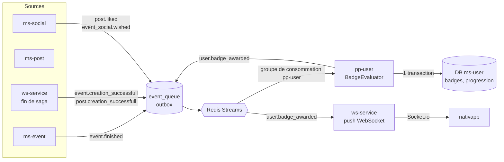
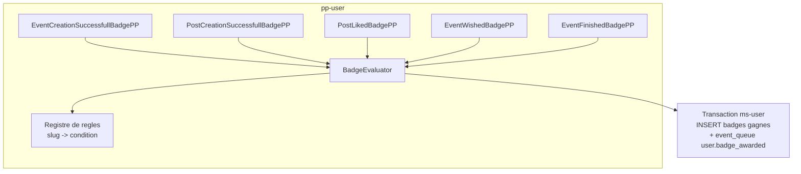
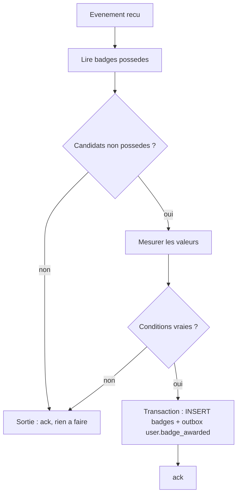

# 02 - Architecture Cible

## 1. Pipeline commun

Aucun microservice n'écrit directement dans Redis : tout passe par l'outbox transactionnel.

## 2. Composition de `pp-user`

`pp-user` reçoit un post-processor par événement source, mais tous délèguent à un composant unique, `BadgeEvaluator`, afin de ne dupliquer aucune règle (DRY).

Le registre de règles est la **seule** source des seuils (5, 10, 20). Les textes du front restent de l'affichage, ils ne décident de rien.

## 3. Algorithme d'évaluation

Pour un utilisateur et un événement source :

1. Lire les slugs de badges déjà possédés (lecture par clé primaire dans la base de `ms-user`).
2. Calculer les badges candidats : ceux liés à l'événement et **non possédés**.
3. S'il n'y a aucun candidat, **sortir immédiatement** (aucun appel réseau).
4. Mesurer les valeurs nécessaires (compteur local ou appel gRPC, selon le badge, voir section 5).
5. Retenir les badges dont la condition est vraie.
6. Dans **une transaction** : insérer les badges, insérer **un** événement `user.badge_awarded` (liste) dans `event_queue`.

## 4. Idempotence

Redis Streams garantit une livraison au moins une fois. Chaque étape doit donc supporter un doublon :

| Mécanisme | Rôle |
| :--- | :--- |
| Contrainte unique `(user_id, badge_id)` sur la table de liaison, `ON CONFLICT DO NOTHING` | Un badge ne peut pas être attribué deux fois. Un doublon n'émet pas de second `user.badge_awarded` (l'insertion renvoie 0 ligne). |
| Table de déduplication des événements traités `(event_id_outbox, user_id)` | Évite de double-compter les compteurs de participation (voir [07](07-evenement-event-finished.md)). |
| Transaction unique badges + outbox | Pas de badge sans notification, pas de notification sans badge. |

L'erreur `USER_ALREADY_HAS_BADGE` de l'attribution manuelle n'est pas un échec dans ce flux : c'est un succès sans effet.

## 5. Comment mesurer chaque condition

| Famille | Mesure | Pourquoi |
| :--- | :--- | :--- |
| Création d'événement, de post (seuil 1) | Aucune : "premier succès" suffit. Le badge n'est pas possédé, l'événement est reçu, donc la condition est vraie. | Pas de compteur nécessaire pour un seuil de 1. |
| Likes (seuil 10) | gRPC `AdminGetUserLikes(userId)` vers `ms-social`, total de la pagination. | L'état est réversible (unlike), la vérité est dans Neo4j. |
| Wishlist (seuil 10) | gRPC `AdminGetUserWishEvent(userId)`, total de la pagination. | Même raison. |
| Participation (seuils 1, 5, 10, 20, éco, socio, hybride) | Compteurs incrémentaux dans `ms-user`. | `ms-social` ne connaît ni l'état ni le type des événements. |

`PaginationResponse` expose bien `total` (vérifié). Demander `page = 1`, `limit = 1` et lire `pagination.total`. Détails, RPC exactes et token interne : [10](10-guide-technique-pp-user.md).

## 6. Performance

Le coût réel n'est pas "50 événements dans une carrière" mais "un traitement par participant et par `event.finished`".

| Mesure | Effet |
| :--- | :--- |
| Sortie anticipée sur les badges possédés (étape 3) | Après 20 événements, plus aucun candidat de participation : coût quasi nul. Entre deux paliers, un seul seuil reste à tester. |
| Compteurs locaux pour la participation | Aucun appel inter-service par participant. |
| `BatchPostProcessor` | Plusieurs événements par lecture Redis, une seule lecture des badges possédés par utilisateur du lot. |
| Point chaud : `post.liked` | Part à chaque like de tout le monde. Mettre en cache Redis l'appartenance au badge (`SISMEMBER`) pour ne pas lire la base à chaque like une fois le badge acquis. |

## 7. Pas de Scatter-Gather

Le Scatter-Gather (`gather_state`) agrège les retours de plusieurs services (2/2). Ici un seul service décide. Le push est un message WebSocket simple, comme `PostLikedPostProcessor` dans `ws-service`.

Le gather qui apparaît dans le scénario de création d'événement est celui de la saga **existante** : le badge se débloque après sa complétion, en second temps.
