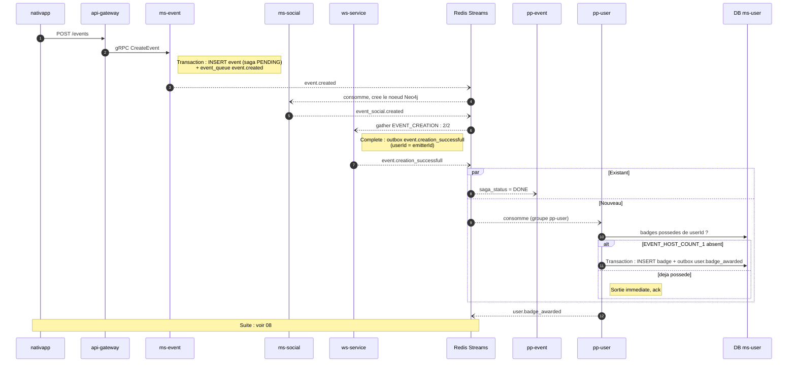

# 03 - Événement `event.creation_successfull`

**Badge débloqué** : `EVENT_HOST_COUNT_1` (Bâtisseur·se, "Créer 1 événement").

**Statut** : **Implémenté et actif** (`EventCreationSuccessfullBadgePostProcessor` dans `pp-user`).

## Pourquoi cet événement et pas `event.created`

`event.created` est le **déclencheur** de la saga de création. À ce stade, `ms-event` et `ms-social` n'ont pas encore confirmé leur part. Si la saga échoue, l'événement est compensé : le badge aurait été donné pour rien.

`event.creation_successfull` est émis par `ws-service` quand le gather atteint 2/2 (voir `base-gather.post-processor.ts`, `handleCompletion`). C'est le seul signal fiable que l'événement existe vraiment.

## Scénario nominal



## Contrat consommé

| Champ | Source | Remarque |
| :--- | :--- | :--- |
| `payload.after.eventId` | gather | Sert à la traçabilité (logs). |
| `payload.after.userId` | `metadata.emitterId` du gather | Utilisateur à récompenser. |

## Règle

```
si "EVENT_HOST_COUNT_1" non possede alors attribuer
```

Aucun compteur : un seuil de 1 ne nécessite aucune mesure.

## Scénarios d'erreur

| Cas | Comportement |
| :--- | :--- |
| Saga en échec | `event.creation_failed` est émis, `event.creation_successfull` ne l'est pas : aucun badge. |
| Livraison en double | La contrainte unique `(user_id, badge_id)` absorbe le doublon, pas de second `user.badge_awarded`. |
| `pp-user` indisponible | Le message reste dans le PEL du groupe, il est rejoué au retour. Le badge arrive en retard, jamais perdu. |
| Événement créé par un admin pour un autre utilisateur | **Edge case accepté** : `userId` vaut `metadata.emitterId` (l'admin), pas l'organisateur (`base-gather.post-processor.ts`, `handleCompletion`). Le badge irait à l'admin. Aucun traitement prévu. |

## Implémenté
 
- Post-processor `EventCreationSuccessfullBadgePostProcessor` dans `pp-user` (`post-processors-runner/post-processor-user/src/post-processors/events/`), groupe de consommation propre sur le stream `Streams.EVENT_SUCCESSFULLY_CREATED`.
- Évaluation et outbox gérées dans `BadgeEvaluator.evaluateEventHostBadge`.
