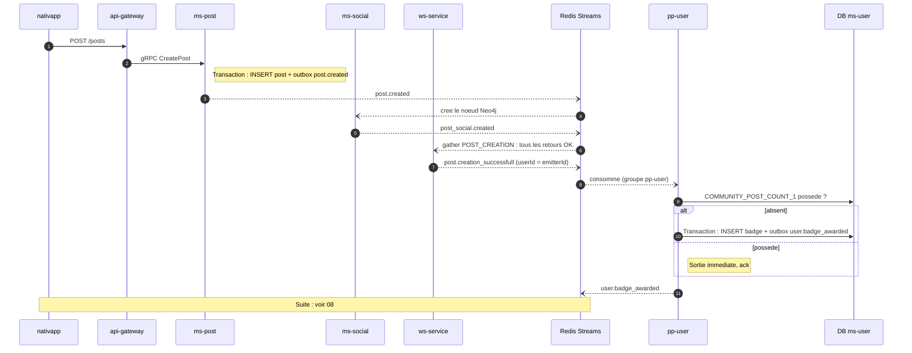

# 04 - Événement `post.creation_successfull`

**Badge débloqué** : `COMMUNITY_POST_COUNT_1` (Première Plume, "Poster 1 post").

**Statut** : l'événement existe déjà (`PostEventMessagingType.POST_CREATION_SUCCESSFULL`). `pp-user` doit ajouter un consommateur.

## Pourquoi pas `post.created`

Même raison que pour les événements ([03](03-evenement-event-creation-successfull.md)) : `post.created` déclenche la saga `POST_CREATION_GATHER` (post + nœud social + médias). Seul le succès de la saga garantit que le post existe. Un post dont les images sont rejetées par le scan (voir `docs/stockage-fichiers/04-flux-post.md`) ne doit pas donner de badge.

## Scénario nominal



## Contrat consommé

| Champ | Source |
| :--- | :--- |
| `payload.after.postId` | gather |
| `payload.after.userId` | `metadata.emitterId` du gather (l'auteur) |

## Règle

```
si "COMMUNITY_POST_COUNT_1" non possede alors attribuer
```

## Scénarios d'erreur

| Cas | Comportement |
| :--- | :--- |
| Saga en échec (`post.creation_failed`) | Aucun badge. |
| Post supprimé juste après | Le badge reste : c'est un acquis (décision 2). |
| Livraison en double | Absorbée par la contrainte unique. |
| `pp-user` indisponible | Rejeu depuis le PEL, badge en retard mais jamais perdu. |

## À créer

Un post-processor `PostCreationSuccessfullBadgePostProcessor` dans `pp-user`, groupe de consommation propre sur `Streams.POST_SUCCESSFULLY_CREATED`.
