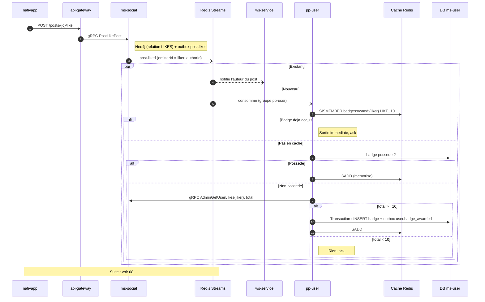

# 05 - Événement `post.liked`

**Badge débloqué** : `SOCIAL_LIKE_COUNT_10` (Soutien du cœur, "Liker 10 posts").

**Statut** : l'événement existe déjà. Émis par `ms-social` (`interaction.service.ts:55`) avec `emitterId` = l'utilisateur qui like, stream `Streams.POST_LIKED`. Consommé aujourd'hui seulement par `ws-service` (`PostLikedPostProcessor`) pour notifier l'auteur du post.

## Particularité : c'est le point chaud

`post.liked` part à **chaque like de chaque utilisateur**. Seuls les 10 premiers likes d'un utilisateur comptent. La sortie anticipée n'est donc pas une optimisation, c'est une nécessité.

## Scénario nominal



## Contrat consommé

| Champ | Source | Remarque |
| :--- | :--- | :--- |
| `emitterId` | enveloppe de l'événement | L'utilisateur qui like : c'est lui qui est récompensé. |
| `payload.after.postId` | `ms-social` | Le post liké. |
| `payload.after.authorId` | `ms-social` | **Piège** : malgré son nom, ce champ contient l'id de celui qui like (`authorId: userId.value`, `interaction.service.ts:51-58`), pas l'auteur du post. Identique à `emitterId`. Ne pas s'en servir pour exclure les auto-likes. |

## Règle

```
si "SOCIAL_LIKE_COUNT_10" non possede
et nombre de posts distincts actuellement likes (hors posts dont authorId == liker) >= 10
alors attribuer
```

| Choix | Raison |
| :--- | :--- |
| Compter l'état courant (`AdminGetUserLikes`), pas les événements reçus | Un like/unlike répété sur le même post ne gonfle pas le compteur. |
| Auto-likes **non exclus dans la première version** | Le message ne donne pas l'auteur du post (voir piège ci-dessus) et `AdminGetUserLikes` renvoie des ids de posts. L'exclusion exigerait de résoudre l'auteur de chaque post liké (appel `ms-post`). À traiter plus tard si l'abus apparaît. Décision à valider. |
| Pas de retrait au unlike | Un badge est un acquis (décision 2). |

## Scénarios d'erreur

| Cas | Comportement |
| :--- | :--- |
| `ms-social` indisponible | Le message n'est pas acquitté, il est rejoué. Pas de perte, pas de badge tant que le compte n'est pas lisible. |
| Course : deux likes simultanés au seuil | Les deux traitements voient 10, la contrainte unique ne laisse passer qu'une insertion. |
| Cache Redis vide ou perdu | Retombe sur la lecture en base. Le cache n'est qu'un accélérateur. |
| Like puis unlike avant le traitement | Le total lu est celui de l'instant : le badge n'est donné que si 10 likes existent réellement. |
| Événement `post.liked` jamais écrit | L'écriture outbox de `ms-social` est en best effort : une erreur est journalisée (`warn`) puis ignorée alors que le like Neo4j existe (`interaction.service.ts:67-71`). Le compte étant basé sur l'état, le like suivant relit le total et rattrape le badge. Latence acceptée, aucune réconciliation prévue. |

## À créer

- Un post-processor `PostLikedBadgePostProcessor` dans `pp-user`, groupe de consommation distinct de celui de `ws-service`.
- Un client gRPC `ms-social` dans `pp-user`, avec token interne (point ouvert, voir [09](09-contrats-et-plan.md)).
