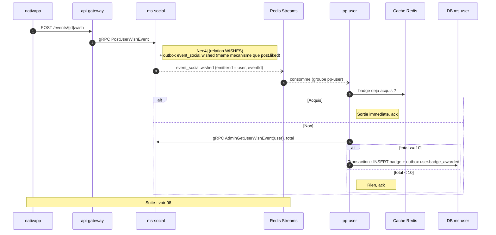

# 06 - Événement `event_social.wished`

**Badge débloqué** : `EVENT_WISHLIST_COUNT_10` (Curieux·se, "Wishlist 10 événements").

**Statut** : **nouvel événement à créer.** `PostUserWishEvent` existe côté `ms-social` (`ParticipationCommandService`) mais n'émet rien.

## Nom

Le nom suit la convention du domaine `social` (`event_social.created`, `post_social.created`). Il est proposé : `event_social.wished`. À valider au moment de la PR `messaging`.

## Scénario nominal



## Contrat à créer

| Élément | Où | Contenu |
| :--- | :--- | :--- |
| Enum | `messaging/src/events/social/payloads.ts` | `EVENT_SOCIAL_WISHED = 'event_social.wished'` |
| Payload | idem | `IEventSocialWishedPayload extends IEventIdPayload, Partial<IUserIdPayload>` |
| Registre | `messaging/src/events/index.ts` | Entrée dans `EventRegistry` |
| Stream | `shared/src/enums/streams.enum.ts` | Ex. `EVENT_SOCIAL_WISHED = 'event-social-wished'` (nom à valider) |
| Émission | `domain-social` (service de participation) | Même transaction que l'écriture de la relation, comme `interaction.service.ts:55` pour `post.liked` |

La règle du STOP s'applique : voir [09](09-contrats-et-plan.md).

## Règle

```
si "EVENT_WISHLIST_COUNT_10" non possede
et nombre d'evenements actuellement en wishlist >= 10
alors attribuer
```

Comme pour les likes, on compte l'état courant : un wish/unwish répété ne gonfle pas le compteur.

## Scénarios d'erreur

| Cas | Comportement |
| :--- | :--- |
| Événement wishlisté puis supprimé | Le compte courant baisse, mais un badge déjà obtenu reste acquis. |
| `ms-social` indisponible | Rejeu depuis le PEL. |
| Doublon de livraison | Absorbé par la contrainte unique. |

## Point à vérifier

Si l'émission dans la transaction de `ms-social` est possible : `ms-social` écrit dans Neo4j, et l'outbox est en Postgres. `post.liked` le fait déjà (`interaction.service.ts:55` injecte un `EventQueueModel` Postgres), mais l'écriture n'est **pas atomique** (vérifié sur `post.liked`) : la relation Neo4j est créée d'abord, puis l'écriture outbox est tentée dans un `try/catch` qui journalise l'erreur et continue (`interaction.service.ts:67-71`). Un souhait peut donc exister sans événement. Le compte étant basé sur l'état (total courant), le souhait suivant rattrape le badge. Latence et perte occasionnelle acceptées ; pour la wishlist, reproduire ce pattern en connaissance de cause. Voir [10](10-guide-technique-pp-user.md), section 8.
