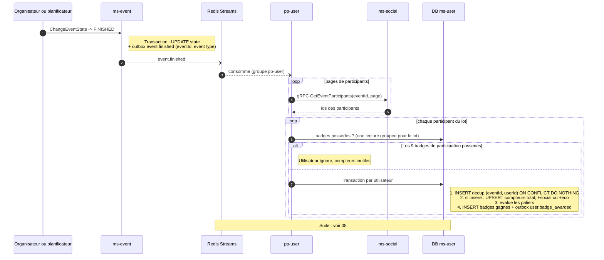

# 07 - Événement `event.finished`

**Badges débloqués** : les 9 badges de participation.

| Famille | Slugs |
| :--- | :--- |
| Total | `EVENT_PARTICIPATION_TIER_1` (1), `_TIER_2` (5), `_TIER_3` (10), `_TIER_4` (20) |
| Socio | `EVENT_SOCIAL_TIER_1` (1), `EVENT_SOCIAL_TIER_2` (5) |
| Éco | `EVENT_ECOLOGY_TIER_1` (1), `EVENT_ECOLOGY_TIER_2` (5) |
| Hybride | `EVENT_HYBRID_ECO_SOCIAL_TIER_1` (5 éco et 5 socio) |

**Statut** : **nouvel événement à créer.** Aujourd'hui `ChangeEventState` vers `FINISHED` (`event.proto`, `EventState`) n'émet rien.

## Pourquoi `FINISHED` et pas l'inscription

Décision 1 du [README](README.md). Une inscription est réversible et instantanée : un cycle inscrit/désinscrit répété suffirait à franchir les paliers. `FINISHED` est un état terminal décidé par l'événement, pas par le participant.

Un événement `CANCELLED` n'émet pas `event.finished` : aucune participation ne compte.

## Pourquoi des compteurs dans `ms-user`

Les conditions portent sur des événements **terminés** et **par type** (éco, socio). Or `ms-social` ne stocke que l'`event_id` dans son nœud (`CreateSocialEventCommand` n'a qu'un champ), et ses requêtes de participation renvoient des listes d'`ids` : il ne connaît ni l'état ni le `EventType`. Recalculer par gRPC exigerait, pour chaque participant, de lister ses participations puis d'interroger `ms-event` événement par événement.

À la place, `event.finished` transporte le type de l'événement, et `pp-user` incrémente des compteurs locaux. Un compteur de participations terminées ne décroît jamais (décision 2), ce qui supprime le risque de dérive par rapport à une source réversible.

## Scénario nominal



## Contrat à créer

| Champ | Type | Remarque |
| :--- | :--- | :--- |
| `eventId` | `string` | Via `IEventIdPayload`. |
| `eventType` | `'SOCIAL' \| 'ECOLOGY'` | Lu dans la ligne `ms-event` au moment de la transition. Évite tout appel retour vers `ms-event`. |

Nom proposé : `EventEventMessagingType.EVENT_FINISHED = 'event.finished'`, stream `EventStream.EVENT_FINISHED`. À valider dans la PR `messaging`.

## Schéma de données proposé (`ms-user`)

| Table | Colonnes | Rôle |
| :--- | :--- | :--- |
| `badge_progress` | `user_id`, `metric`, `value`, PK `(user_id, metric)` | Compteurs `EVENTS_FINISHED_TOTAL`, `EVENTS_FINISHED_SOCIAL`, `EVENTS_FINISHED_ECOLOGY`. |
| `badge_progress_events` | `event_id`, `user_id`, PK `(event_id, user_id)` | Déduplication : un événement compte une seule fois par utilisateur, même en cas de rejeu. |

## Règles d'évaluation

```
total   : 1 -> TIER_1, 5 -> TIER_2, 10 -> TIER_3, 20 -> TIER_4
social  : 1 -> SOCIAL_TIER_1, 5 -> SOCIAL_TIER_2
eco     : 1 -> ECOLOGY_TIER_1, 5 -> ECOLOGY_TIER_2
hybride : social >= 5 ET eco >= 5 -> HYBRID_ECO_SOCIAL_TIER_1
```

Les paliers sont testés avec `>=`, pas `==`, et tous les paliers manquants sont attribués dans la même passe. Ce cas arrive : un utilisateur peut franchir `social >= 5` et `eco >= 5` dans le même traitement, ou passer plusieurs seuils après un rattrapage.

Exemple : un participant à 4 événements (dont 4 socio) participe à un 5e événement éco. Compteurs : total 5, socio 4, éco 1. Badges gagnés : `PARTICIPATION_TIER_2` et `ECOLOGY_TIER_1`, dans **un seul** message `user.badge_awarded`.

## Scénarios d'erreur

| Cas | Comportement |
| :--- | :--- |
| Rejeu de `event.finished` | La déduplication `(eventId, userId)` empêche le double comptage. |
| Panne de `pp-user` au milieu d'un événement de 500 participants | Chaque participant est traité dans sa propre transaction. Au rejeu, les déjà traités sont ignorés par la déduplication, les autres sont repris. |
| `ms-social` indisponible | Le message n'est pas acquitté et est rejoué. |
| Participant inscrit après la fin | Hors périmètre : la liste lue est celle des participants au traitement. À aligner avec la règle d'inscription de `ms-event` (inscription interdite hors `PUBLISHED`/`IN_PROGRESS`, à vérifier). |
| Événement repassé de `FINISHED` à un autre état | Hors périmètre : un badge est un acquis. À interdire côté `ms-event` si possible. |

## Points ouverts spécifiques

1. **Qui passe un événement à `FINISHED` ?** L'organisateur à la main, ou un job planifié à l'heure de fin ? Cela change l'émetteur, pas le flux.
2. **Rattrapage de l'historique.** Les utilisateurs qui ont déjà participé à des événements terminés avant le déploiement n'ont aucun compteur. Il faut un job unique de rattrapage (lecture `ms-event` + `ms-social`) ou accepter de repartir de zéro.
3. **Fallback.** `ChangeEventState` a un fallback BullMQ (`FALLBACK_CHANGE_EVENT_STATE`). Le handler de fallback doit émettre `event.finished` lui aussi, sinon un fallback ferait perdre l'événement.
