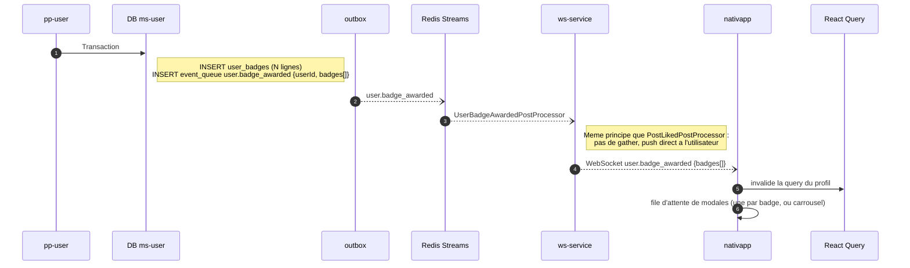

# 08 - Événement `user.badge_awarded`

Dernier maillon commun : il notifie le client qu'un ou plusieurs badges viennent d'être gagnés.

**Statut** : **nouvel événement à créer**, avec son type WebSocket et son post-processor dans `ws-service`.

## Un message par passage de `pp-user`

Décision 3 du [README](README.md). `pp-user` décide de tous les badges d'un utilisateur en une passe et les écrit dans **une** transaction avec **une** ligne d'outbox. Le message transporte donc la liste.

## Scénario

## Contrats à créer

| Contrat | Contenu |
| :--- | :--- |
| `UserEventMessagingType.USER_BADGE_AWARDED = 'user.badge_awarded'` | Événement outbox. |
| `IUserBadgeAwardedPayload` | `userId: string`, `badges: IBadgePayload[]`. `IBadgePayload` existe déjà dans `messaging/src/events/user/payloads.ts` (`id`, `name`, `slug`, `description`, `iconPath?`). |
| Type WebSocket `user.badge_awarded` | À ajouter dans `messaging/src/websockets/users/` et dans `WebsocketEventRegistry`. |
| Stream | Entrée dans `Streams` (`shared`). |

## Côté `ws-service`

Un post-processor `UserBadgeAwardedPostProcessor`, calqué sur `PostLikedPostProcessor` (`ws-service/src/post-processors/posts/interactions/post-liked.post-processor.ts`) : lire le payload, résoudre l'utilisateur cible (`payload.userId`), appeler `NotificationService`. Aucun `gather_state`.

## Côté `nativapp`

Éléments existants (vérifiés) :

- `Badge`, `BadgeMedallion` et `BadgeModal` (`components/dataDisplay/badge/`), alimentés par `BADGE_REGISTRY` selon le slug.
- `resolveBadgeVariant` associe un badge reçu de l'API à un variant, avec un rendu de secours si le slug est inconnu.

À créer :

1. Un listener du type WebSocket `user.badge_awarded` (non vérifié : la présence d'un mécanisme de listeners dans `nativapp` doit être confirmée avant de coder).
2. L'invalidation de la query du profil (TanStack Query), pour que `ProfileBadges` affiche les nouveaux badges.
3. La présentation : une file de modales (une par badge) ou un carrousel unique. Choix de design à trancher.

## Scénarios d'erreur

| Cas | Comportement |
| :--- | :--- |
| Utilisateur hors ligne | Le push est perdu (WebSocket non persistant). Les badges sont néanmoins en base et visibles au prochain chargement du profil. Pas de modale. |
| `ws-service` indisponible | Le message reste dans le stream, rejoué au retour : la modale arrive en retard. |
| Slug inconnu du front | `ProfileBadges` affiche le rendu de secours (icône générique et nom). |

## Point ouvert

Pour qu'un utilisateur hors ligne voie quand même la modale, il faudrait un marqueur "badge non vu" (ex. `seen_at` sur la liaison utilisateur-badge, ou comparaison avec `awardedAt`). Non prévu dans cette version : à décider si la modale est jugée essentielle ou secondaire.
