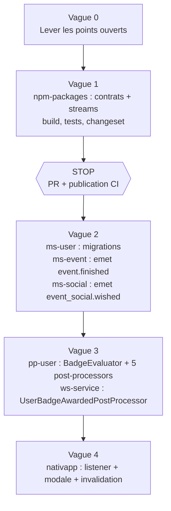

# 09 - Contrats, Plan d'Implémentation et Points Ouverts

## 1. Contrats à créer

| Contrat | Repo | Fichier cible | Utilisé par |
| :--- | :--- | :--- | :--- |
| `event.finished` + `IEventFinishedPayload` (`eventId`, `eventType`) | `npm-packages` | `messaging/src/events/event/payloads.ts` | `ms-event` (émet), `pp-user` (consomme) |
| `event_social.wished` + `IEventSocialWishedPayload` | `npm-packages` | `messaging/src/events/social/payloads.ts` | `ms-social` (émet), `pp-user` (consomme) |
| `user.badge_awarded` + `IUserBadgeAwardedPayload` (`userId`, `badges[]`) | `npm-packages` | `messaging/src/events/user/payloads.ts` | `pp-user` (émet), `ws-service` (consomme) |
| Type WebSocket `user.badge_awarded` | `npm-packages` | `messaging/src/websockets/users/` | `ws-service`, `nativapp` |
| Streams `EVENT_FINISHED`, `EVENT_SOCIAL_WISHED`, `USER_BADGE_AWARDED` | `npm-packages` | `shared/src/enums/streams.enum.ts` | outbox runners, post-processors |
| Migration `badge_progress`, `badge_progress_events` | `ms-user` | `src/migrations/domain/` | `pp-user` |

Aucun changement de proto n'est prévu, **sous réserve** que `PaginationResponse` expose un total (voir [02](02-architecture-cible.md), section 5). Sinon, une évolution de `proto-registry` s'ajoute, avec sa propre cascade (`volontariapp-proto-contract-evolution`).

## 2. Règle du STOP

Toute modification de `npm-packages` impose l'arrêt après `yarn build`, `yarn test`, `yarn changeset add` et `yarn changeset version`. Les microservices consommateurs ne sont modifiés qu'après la publication par la CI. Le plan est donc découpé en vagues bloquantes.

## 3. Vagues

| Vague | Contenu | Préalable |
| :--- | :--- | :--- |
| 0 | Trancher les points ouverts ci-dessous. | Aucun. |
| 1 | Contrats et streams dans `npm-packages`. | Vague 0. |
| 2 | Émetteurs (`ms-event`, `ms-social`), migrations `ms-user`, y compris le fallback de `ChangeEventState`. | Publication de la vague 1. |
| 3 | `pp-user` (moteur et 5 consommateurs) et `ws-service`. | Vague 2 déployée. |
| 4 | `nativapp`. | Vague 3 déployée. |

Les consommateurs `pp-user` peuvent être livrés avant les émetteurs sans risque : sans événement, ils restent inactifs.

## 4. Points ouverts

| # | Point | Impact | Document |
| :--- | :--- | :--- | :--- |
| 1 | Comment `pp-user` obtient un `INTERNAL_TOKEN` pour appeler `ms-social` (`GrpcInternalGuard`). | Bloquant pour likes, wishlist, participants. | [05](05-evenement-post-liked.md) |
| 2 | `pp-user` peut-il utiliser `@volontariapp/domain-user` pour écrire les badges ? | Détermine où vit le code d'écriture. | [01](01-etat-des-lieux.md) |
| 3 | `PaginationResponse` expose-t-il un total ? | Nécessaire pour compter likes et wishlist sans tout paginer. | [02](02-architecture-cible.md) |
| 4 | Événement créé par un admin pour un tiers : `userId` du succès de saga vaut l'admin. | Le badge `EVENT_HOST_COUNT_1` irait à l'admin. | [03](03-evenement-event-creation-successfull.md) |
| 5 | Exclusion des auto-likes : faisable sans appel par post ? | Faisabilité de la règle. | [05](05-evenement-post-liked.md) |
| 6 | Qui passe un événement à `FINISHED` (humain ou job planifié) ? | Émetteur de `event.finished`. | [07](07-evenement-event-finished.md) |
| 7 | Rattrapage de l'historique de participation. | Utilisateurs existants sans compteur. | [07](07-evenement-event-finished.md) |
| 8 | Modale pour un utilisateur hors ligne (marqueur "non vu"). | Expérience utilisateur. | [08](08-evenement-user-badge-awarded.md) |
| 9 | Le front possède-t-il déjà un mécanisme de listeners WebSocket ? | Taille de la vague 4. | [08](08-evenement-user-badge-awarded.md) |

## 5. Tests attendus

Conformément aux conventions du projet : mocks dans des fichiers `*.mock.ts`, données via factories `*.factory.ts`, `jest.spyOn()` avec restauration systématique.

| Cible | Cas minimum |
| :--- | :--- |
| `BadgeEvaluator` | Sortie anticipée sans appel réseau quand tout est possédé ; attribution de plusieurs paliers dans une passe ; seuils `>=` ; idempotence sur rejeu. |
| `EventFinishedBadgePostProcessor` | Déduplication `(eventId, userId)` ; événement éco vs socio ; hybride ; reprise après échec partiel. |
| `PostLikedBadgePostProcessor` | Cache Redis hit/miss ; seuil à 9 puis 10 ; courses sur la contrainte unique. |
| `UserBadgeAwardedPostProcessor` | Push avec liste de plusieurs badges ; utilisateur sans socket. |

## 6. Mise à jour des skills

Ce chantier modifiera `pp-user`, `ws-service`, `messaging` et `ms-user`. En fin de chaque vague, lancer `python3 .agents/skills/volontariapp-skill-evolution/scripts/evolve.py plan` pour relire les skills `volontariapp-implement-async-event-flow` et `volontariapp-implement-async-job-flow`.
