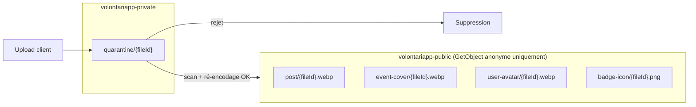
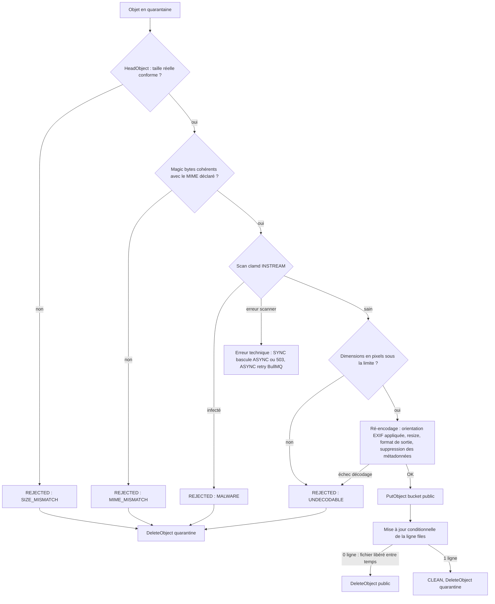

# 02 - Architecture cible

## 1. Responsabilités par composant

| Composant | Responsabilité | Ne fait PAS |
| :--- | :--- | :--- |
| `nativapp` | Choisit l'image, la **redimensionne et la ré-encode en JPEG** avant envoi, demande l'URL signée, uploade directement sur S3, confirme, envoie les `file_id` et une clé d'idempotence aux routes métier. | Ne choisit ni la visibilité ni le mode de validation. |
| `api-gateway` | Expose `/storage/*`, relaie `fileIds` / `avatarFileId` / `coverFileId` / `iconFileId` et la clé d'idempotence, génère l'`INTERNAL_TOKEN`, calcule les URL publiques à la lecture. | Ne reçoit jamais d'octets de fichier. |
| `ms-storage` | Génère les URL signées, confirme les uploads, traite les fichiers en mode SYNC, réserve les fichiers (`ConfirmFileAttachment`). | Ne connaît pas les règles métier des posts, events ou users. |
| `worker-storage` | Exécute `storage.scan_file` (mode ASYNC, et reprise des traitements SYNC interrompus) et `storage.cleanup_files`. | Ne décide pas du mode de validation. |
| `post-processor-storage` | Confirme les rattachements (synchrones) ou valide puis rattache les fichiers (rattachement asynchrone quand `ms-storage` était indisponible), et libère les fichiers en réaction aux événements des autres domaines. Émet le résultat du scan si le fichier est déjà traité, ou `storage.attachment_rejected`. | N'appelle aucun service, ne touche pas S3. Ne dépend que de la base `ms_storage`. |
| `ms-post` / `ms-event` / `ms-user` | Calculent l'id de l'entité, appellent `ConfirmFileAttachment`, stockent des `file_id` et un statut média propre à leur entité, émettent l'événement de création / remplacement dans la même transaction. | Ne vérifient ni taille, ni MIME, ni malware. Ne stockent jamais d'URL. |
| `pp-post` / `pp-event` | Mettent à jour le statut média de leur entité à réception de `storage.file_scanned` / `storage.file_rejected`. | |
| `ws-service` | Notifie le propriétaire du résultat du scan. | N'est jamais un maillon de la chaîne métier. |

### Packages npm

| Package | Contenu | Utilisé par |
| :--- | :--- | :--- |
| `@volontariapp/domain-storage` | Enums, value objects, politiques (`VALIDATION_POLICY_BY_ENTITY`), helpers de clés et d'URL, **`FileModel` (TypeORM) et `PostgresFileRepository`**, exceptions. Suit la convention des autres `domain-*`. | `ms-storage`, `worker-storage`, `post-processor-storage`, `api-gateway` (helpers d'URL) |
| Package d'infrastructure storage (nom à définir) | Pipeline de traitement : client S3 (quarantaine, public, signature), vérification des magic bytes, client clamd, ré-encodage d'image. | `ms-storage` (SYNC), `worker-storage` (ASYNC) |
| Client gRPC storage (nom à définir, package léger distinct) | `StorageClient` partagé : propagation de `x-internal-token`, mapping typé des erreurs gRPC. Ne dépend pas du pipeline. | `ms-post`, `ms-event`, `ms-user` |

Séparer le client du pipeline évite d'embarquer clamd et la bibliothèque de ré-encodage dans les services métier.

## 2. Buckets, clés d'objets et URL



Règles :

- **Tout upload arrive en quarantaine**, sous `quarantine/{fileId}`. La policy du POST signé fixe la clé, le `Content-Type` et la plage de taille.
- **Signature avec un endpoint public** : le client S3 qui signe utilise `s3.publicEndpoint` (joignable par le téléphone), distinct de `s3.endpoint` utilisé par les services. La signature SigV4 inclut l'hôte.
- **La clé publique est déterministe** : `{entity-type}/{fileId}.{ext}`, où `ext` dépend du format de sortie défini par `domain-storage`.
- **L'URL publique se calcule sans appel réseau** : `buildPublicFileUrl(entityType, fileId, publicBaseUrl)` dans `domain-storage`.
- **Politique anonyme du bucket public** : uniquement `s3:GetObject`, pas de `s3:ListBucket` (politique JSON explicite, pas `mc anonymous set download`).
- **Règle de lifecycle S3 sur `quarantine/`** : expiration à 24 h, filet de sécurité.

## 3. Modes de traitement et politiques

Deux décisions distinctes sont prises par `ms-storage` :

1. **Le mode de traitement d'un fichier** (scan et ré-encodage) : **SYNC par défaut**, **ASYNC si le fichier est volumineux** ou si le traitement synchrone échoue pour une raison technique.
2. **Le mode de rattachement à l'entité** : **synchrone par défaut** (`ConfirmFileAttachment`), **asynchrone si `ms-storage` est indisponible** (voir [03-cycle-de-vie-fichier.md](03-cycle-de-vie-fichier.md), section 4).

### Choix du mode de traitement

Le mode est calculé par `domain-storage` (`VALIDATION_POLICY_BY_ENTITY`) à partir de l'`EntityType` et de la **taille déclarée** à `GenerateUploadUrl`, puis enregistré dans `files.validation_mode`. Le client ne peut pas le choisir : une taille réelle supérieure à la taille déclarée est rejetée (`SIZE_MISMATCH`).

```text
si taille déclarée > maxSizeBytes          : refus INVALID_ARGUMENT
sinon si taille déclarée <= syncMaxSizeBytes : SYNC
sinon si asyncAllowed                      : ASYNC
sinon                                      : refus INVALID_ARGUMENT
```

| `EntityType` | Taille max | Seuil SYNC | ASYNC autorisé | MIME acceptés | Format de sortie | Max par entité |
| :--- | :--- | :--- | :--- | :--- | :--- | :--- |
| `USER_AVATAR` | 1 Mo | 1 Mo | Non | jpeg, png, webp | webp 512x512 | 1 |
| `BADGE_ICON` | 1 Mo | 1 Mo | Non | png, webp (SVG refusé) | png 256x256 | 1 |
| `POST` | 10 Mo | 1 Mo | Oui | jpeg, png, webp | webp, largeur max 2048 | 10 |
| `EVENT_COVER` | 10 Mo | 1 Mo | Oui | jpeg, png, webp | webp, largeur max 2048 | 1 |

- **SYNC** : `ConfirmUpload` exécute le pipeline et répond `CLEAN` (avec `public_url`) ou `REJECTED` dans la même requête.
- **ASYNC** : `ConfirmUpload` passe le fichier en `SCANNING`, écrit un job `storage.scan_file` dans `jobs_outbox` (même transaction) et répond immédiatement.
- **Bascule technique SYNC vers ASYNC** : si le pipeline synchrone échoue pour une raison technique (clamd ou S3 indisponible, timeout) et que l'`EntityType` autorise l'ASYNC, `ms-storage` garde le fichier en `SCANNING`, passe `validation_mode` à `ASYNC`, écrit le job `storage.scan_file` et répond `SCANNING`. Pour l'avatar et le badge (ASYNC non autorisé), le fichier repasse en attente d'upload et `ms-storage` répond 503 ([03-cycle-de-vie-fichier.md](03-cycle-de-vie-fichier.md), section 1).
- **Redimensionnement côté client obligatoire** : `nativapp` redimensionne (côté le plus long : 1024 px pour avatar et badge, 2048 px sinon) et ré-encode en JPEG avant l'upload. La plupart des images passent ainsi sous le seuil SYNC, et le cas du format HEIC renvoyé par iOS est réglé.
- **Seuils** : 1 Mo est une proposition, à ajuster après mesure de la durée du pipeline synchrone (deadline gateway de 10 s).

## 4. Pipeline de traitement d'un fichier

Le même code est exécuté en mode SYNC (dans `ms-storage`) et ASYNC (dans `worker-storage`). Une erreur technique (`erreur scanner`) déclenche en SYNC la bascule ASYNC ou le 503 décrits en section 3.



- Le **ré-encodage** n'est pas optionnel : il neutralise la majorité des fichiers polyglottes, supprime les données GPS (PII) et normalise le poids servi.
- L'**orientation EXIF** est appliquée avant la suppression des métadonnées, sinon les photos sortent tournées.
- La **limite de pixels** est vérifiée sur l'en-tête avant le décodage complet (protection contre les bombes de décompression).
- La **mise à jour conditionnelle** est détaillée dans [03-cycle-de-vie-fichier.md](03-cycle-de-vie-fichier.md), section 5.

## 5. Ids d'entité et idempotence

Pour réserver un fichier, le service métier doit connaître l'id de l'entité **avant** de l'écrire, et cet id doit rester le même en cas de fallback ou de réessai client.

- Le client envoie une **clé d'idempotence** (UUID v4) avec chaque création (`CreatePost`, `CreateEvent`, `CreateBadge`).
- Le service calcule l'id de l'entité de façon déterministe : `UUID v5(namespace du domaine, ownerId + ":" + idempotencyKey)`. Deux utilisateurs ne peuvent pas produire le même id, et un réessai produit le même id.
- `domain-post` / `domain-event` / `domain-user` acceptent un id fourni à la création (passage de `@PrimaryGeneratedColumn` à un id applicatif, comportement TypeORM à valider dans le ticket).
- Les payloads de fallback (`messaging`) transportent l'id calculé : le rejeu crée la même entité.
- **Création idempotente** : `INSERT ... ON CONFLICT (id) DO NOTHING`. Si 0 ligne est insérée, le repository n'écrit **pas** l'événement de création, relit la ligne existante et vérifie que l'auteur est le même (sinon `FAILED_PRECONDITION`). L'actuel `manager.save` de `createWithPostCreated` ferait une mise à jour puis réécrirait `post.created` (doublon pour `post-processor-social`), et `PostService.create` traduit aujourd'hui toute erreur `23505` en `POST_ALREADY_EXISTS` sans distinguer la clé primaire.
- Pour les mises à jour (avatar, photo d'event, icône de badge), l'id de l'entité existe déjà.

## 6. Statut média et visibilité côté entités métier

Chaque service métier porte un statut média **distinct de son statut de saga** (`saga_status` : `PENDING`, `DONE`, `CANCEL`) :

| Service | Colonnes | Valeurs du statut | Visibilité |
| :--- | :--- | :--- | :--- |
| `ms-post` | `media_status` + table `post_media (post_id, file_id, position, scan_status)` | `NONE`, `PENDING`, `READY`, `REJECTED` | Visible des autres utilisateurs si `media_status IN (NONE, READY)`. |
| `ms-event` | `cover_file_id`, `cover_status` | `NONE`, `PENDING`, `READY`, `REJECTED` | Toujours visible. Placeholder tant que `cover_status != READY`. |
| `ms-user` | `avatar_file_id` | | Avatar toujours `CLEAN` au rattachement (mode SYNC). |
| `ms-user` (badges) | `badges.icon_file_id` | | Icône toujours `CLEAN` au rattachement (mode SYNC). |

**Où s'applique le filtre de visibilité des posts** : dans les requêtes de lecture de `domain-post` (`findById` pour un non-auteur, `listPaginated`, `search`). Le fil d'actualité passe par le graphe `ms-social`, alimenté par `post.created` : les ids qu'il renvoie sont hydratés par `ms-post`, qui écarte les posts non visibles. Le chemin exact d'hydratation du fil est à confirmer au moment du ticket.

> [!NOTE]
> Aucune requête de lecture ne filtre aujourd'hui sur `saga_status`. Ce manque est antérieur au stockage de fichiers et reste hors périmètre, mais le filtre `media_status` doit être écrit de façon à pouvoir y ajouter `saga_status` plus tard.
