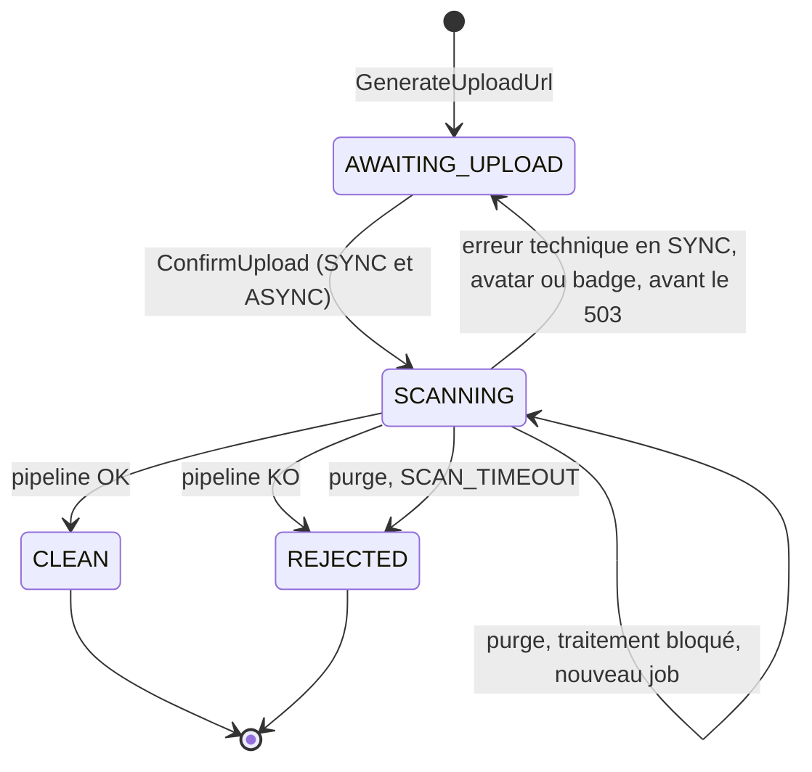
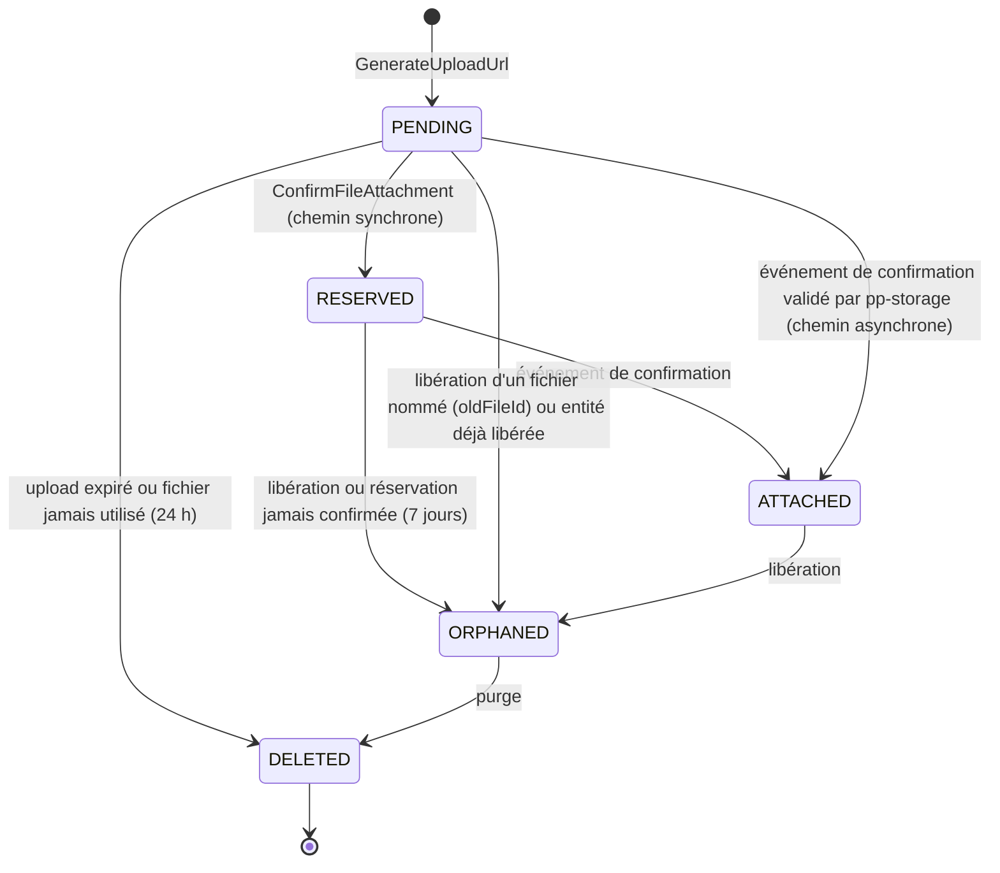
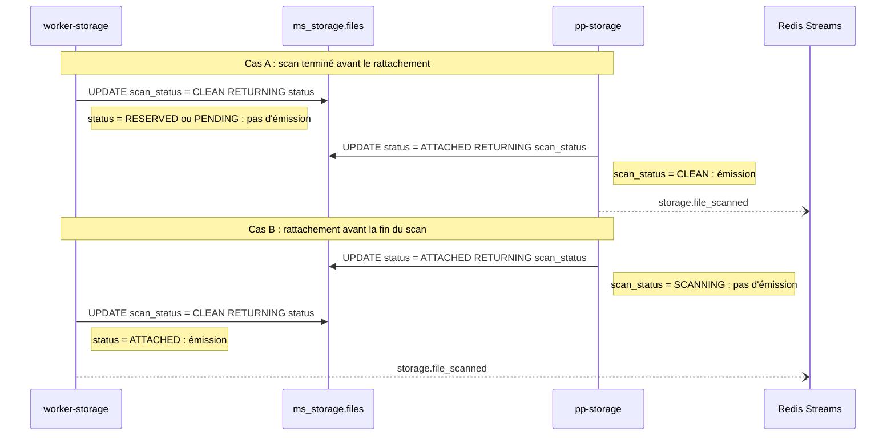

# 03 - Cycle de vie d'un fichier

Un fichier a **deux dimensions d'état indépendantes**, portées par deux colonnes distinctes de `ms_storage.files` :

- **`status` (`FileStatus`)** : où en est le fichier vis-à-vis de son entité (rattachement).
- **`scan_status` (`ScanStatus`)** : où en est la validation du contenu.

> [!IMPORTANT]
> Ces deux axes ne doivent pas être fusionnés. Un post peut réserver un fichier **pendant** que celui-ci est encore en cours de scan : le fichier est alors à la fois `RESERVED` et `SCANNING`.

## 1. `ScanStatus` : validation du contenu



| Valeur | Signification | Objet S3 |
| :--- | :--- | :--- |
| `AWAITING_UPLOAD` | URL signée émise, upload non confirmé. | Peut-être en quarantaine. |
| `SCANNING` | Upload confirmé, traitement en cours (inline en SYNC, job en ASYNC). | En quarantaine. |
| `CLEAN` | Traité et publié. | Version publique uniquement. |
| `REJECTED` | Refusé, `rejection_reason` renseigné. | Supprimé. |

En mode SYNC, `ConfirmUpload` passe aussi par `SCANNING` : cet état sert de verrou contre deux confirmations simultanées. Sur une **erreur technique** pendant le pipeline synchrone (clamd ou S3 indisponible, timeout) :

- **`EntityType` qui autorise l'ASYNC (post, photo d'événement)** : bascule en ASYNC, dans une transaction.

  ```sql
  UPDATE files SET validation_mode = 'ASYNC'
  WHERE id = $1 AND scan_status = 'SCANNING';
  -- + INSERT jobs_outbox storage.scan_file, même transaction
  ```

  `ms-storage` répond avec le `FileMetadata` en `SCANNING`. Le client continue comme pour un fichier volumineux.

- **Avatar et badge (ASYNC non autorisé)** : retour en attente d'upload avec échéance repoussée (l'objet est déjà en quarantaine), puis 503. Le réessai du client repart de zéro.

  ```sql
  UPDATE files
  SET scan_status = 'AWAITING_UPLOAD',
      upload_expires_at = GREATEST(upload_expires_at, now() + interval '15 minutes')
  WHERE id = $1 AND scan_status = 'SCANNING';
  ```

Si `ms-storage` crashe pendant le traitement synchrone, le fichier reste `SCANNING` et la purge le reprend en ASYNC, une seule fois, grâce à la colonne `rescan_scheduled_at` (section 8). `scan_attempts` n'est qu'un compteur informatif, incrémenté à chaque `ConfirmUpload` : il ne conditionne aucune règle.

## 2. `FileStatus` : rattachement à une entité



| Valeur | Signification |
| :--- | :--- |
| `PENDING` | Appartient à son propriétaire, rattaché à rien. |
| `RESERVED` | Réservé de façon synchrone par un service métier pour `(entity_type, entity_id)`. L'entité n'est peut-être pas encore écrite. |
| `ATTACHED` | L'événement de création ou de mise à jour de l'entité a été reçu et validé : l'entité existe et référence le fichier. |
| `ORPHANED` | L'entité a été supprimée, annulée, ou l'image remplacée. En attente de purge. |
| `DELETED` | Objets S3 supprimés. Ligne conservée pour l'audit. |

**Règle absolue** : un fichier `ORPHANED` ou `DELETED` ne revient jamais à `RESERVED` ni à `ATTACHED`.

## 3. Rattachement synchrone par défaut (`ConfirmFileAttachment`)

Appelé en gRPC par le service métier, **avant** l'écriture de l'entité et avant tout `withFallback`, avec un **deadline court (2 s)**. Il permet de renvoyer une erreur 422 immédiate et verrouille le fichier pour l'entité.

Entrée : `file_ids`, `entity_type`, `entity_id`. Le propriétaire est le `CurrentUser` de l'`INTERNAL_TOKEN` propagé.

Algorithme, dans une transaction :

1. Dédoublonner `file_ids`. Refuser si le nombre dépasse le maximum de la politique (`INVALID_ARGUMENT`).
2. `SELECT ... FROM files WHERE id = ANY($ids) FOR UPDATE`.
3. Classer chaque fichier avec la **règle de validation du rattachement** (partagée avec le chemin asynchrone, section 4) :

| Condition | Résultat |
| :--- | :--- |
| Inconnu, ou `owner_id` différent | `NOT_FOUND` (ne pas révéler l'existence) |
| `entity_type` différent de celui déclaré à `GenerateUploadUrl` | `FAILED_PRECONDITION` |
| `scan_status IN (AWAITING_UPLOAD, REJECTED)`, ou `SCANNING` pour un `EntityType` sans ASYNC (avatar, badge) | `FAILED_PRECONDITION` |
| `status IN (RESERVED, ATTACHED)` pour **le même** `(entity_type, entity_id)` | OK, aucune écriture (réessai idempotent) |
| `status IN (RESERVED, ATTACHED)` pour une autre entité, ou `ORPHANED` / `DELETED` | `FAILED_PRECONDITION` |
| `status = PENDING` et `scan_status = CLEAN`, ou `SCANNING` pour un `EntityType` avec ASYNC | À réserver |

4. Si un seul fichier est en erreur : `ROLLBACK`, renvoyer l'erreur la plus spécifique (tout ou rien).
5. Sinon : `UPDATE files SET status = 'RESERVED', entity_id = $entityId, reserved_at = now() WHERE id = ANY($aReserver)`.
6. Répondre avec le `FileMetadata` de chaque fichier (dont `scan_status`).

La règle de validation est implémentée **une seule fois**, dans `PostgresFileRepository` (`domain-storage`), et utilisée par `ms-storage` (chemin synchrone) et `post-processor-storage` (chemin asynchrone).

Grâce à l'id d'entité déterministe ([02-architecture-cible.md](02-architecture-cible.md), section 5), un réessai client ou un fallback retombe sur la ligne "même entité" et réussit.

### Réaction du service métier selon la réponse

| Réponse de `ConfirmFileAttachment` | Post / photo d'événement | Avatar / badge |
| :--- | :--- | :--- |
| OK | Écriture de l'entité, statut média selon les `scan_status` renvoyés | Écriture de l'entité |
| `NOT_FOUND` / `FAILED_PRECONDITION` / `INVALID_ARGUMENT` | 404 / 422 / 400, rien n'est écrit | Idem |
| `UNAVAILABLE` / `DEADLINE_EXCEEDED` | **Rattachement asynchrone** (section 4) : écriture de l'entité avec statut média `PENDING` | 503, le client réessaie |

Pour l'avatar et le badge, il n'y a pas de rattachement asynchrone : l'image serait affichée avant validation (aucun statut média côté `ms-user`), et `ConfirmUpload` dépend de toute façon de `ms-storage`.

## 4. Confirmation, rattachement asynchrone et règle d'émission

### Événements de confirmation

Consommés par `post-processor-storage`, tous émis dans la **même transaction** que l'écriture de l'entité. Ils portent toujours les identifiants de fichiers et le propriétaire, pour permettre le rattachement asynchrone :

| Entité | Événement | Champs utilisés |
| :--- | :--- | :--- |
| Post | `post.created` (existant, enrichi) | `postId`, `userId`, `fileIds` |
| Event | `event.created` (existant, enrichi) | `eventId`, `userId` (acteur, rendu obligatoire), `coverFileId?` |
| Event | `event.cover_replaced` (nouveau) | `eventId`, `userId` (acteur), `newFileId?`, `oldFileId?` |
| User | `user.avatar_replaced` (nouveau) | `userId`, `newFileId?`, `oldFileId?` |
| Badge | `user.badge_created` (nouveau) | `badgeId`, `iconFileId?` |
| Badge | `user.badge_icon_replaced` (nouveau) | `badgeId`, `newFileId?`, `oldFileId?` |

### Algorithme unique de `post-processor-storage`

Le même algorithme couvre les deux chemins : il rattache un fichier `RESERVED` pour l'entité (chemin synchrone), ou valide puis rattache un fichier `PENDING` (chemin asynchrone).

1. **Entité déjà libérée ?** Si `(entity_type, entity_id)` figure dans `released_entities` (section 6), passer en `ORPHANED` les fichiers nommés appartenant au propriétaire (`status IN (PENDING, RESERVED)`), puis s'arrêter.
2. **Rattachement**, un seul `UPDATE` par fichier nommé :

```sql
UPDATE files
SET status = 'ATTACHED', entity_id = $entityId, attached_at = now()
WHERE id = $fileId
  AND entity_type = $entityType
  AND (
        (status = 'RESERVED' AND entity_id = $entityId)                  -- chemin synchrone
     OR (status = 'PENDING' AND owner_id = $ownerId
         AND scan_status IN ('SCANNING', 'CLEAN') AND $asyncAllowed)     -- chemin asynchrone
  )
RETURNING id, owner_id, scan_status, rejection_reason;
```

3. **0 ligne** : relire la ligne et classer.
   - Déjà `ATTACHED` pour la même entité (événement rejoué) : rien.
   - `ORPHANED` pour la même entité (libération arrivée avant) : rien.
   - Sinon (inconnu, autre propriétaire, mauvais type, rejeté, upload non confirmé, déjà rattaché ailleurs) : écrire **`storage.attachment_rejected`** `{ fileId, entityType, entityId, reason }` dans `event_queue`. Le post-processor métier passe l'image en `REJECTED`.
4. **1 ligne** : appliquer la règle d'émission ci-dessous.

Une réservation **expirée n'empêche pas** le rattachement : aucune condition ne porte sur une date. Un fallback rejoué plusieurs heures plus tard rattache donc correctement ses fichiers.

**Sécurité du chemin asynchrone** : l'entité référence un `file_id` qui n'est pas encore validé, mais rien n'est affiché tant que le statut média n'est pas `READY`, et `READY` ne peut venir que de `storage.file_scanned`, émis uniquement pour un fichier `ATTACHED` après validation. Un `file_id` frauduleux finit en `REJECTED` sans jamais être affiché.

### Règle d'émission du résultat du scan

`storage.file_scanned` / `storage.file_rejected` ne sont émis **que pour un fichier `ATTACHED` dont le `scan_status` est terminal**. Deux transitions peuvent remplir ces deux conditions, et c'est **celle qui arrive en second** qui émet, dans sa propre transaction :

- **`worker-storage`** (ou `ms-storage` en SYNC), à la fin du traitement : s'il lit `status = ATTACHED` dans le `RETURNING` de sa mise à jour, il écrit l'événement dans `event_queue`.
- **`post-processor-storage`**, au rattachement : pour chaque ligne passée `ATTACHED` dont le `scan_status` est `CLEAN` ou `REJECTED`, il écrit l'événement dans `event_queue`.

Les deux opérations sont des `UPDATE` de la même ligne, sérialisés par le verrou de ligne PostgreSQL : le second attend le commit du premier, réévalue son `WHERE` sur la version validée, et son `RETURNING` contient les colonnes écrites par le premier. Exactement une des deux transitions émet. Trois conditions sont indispensables :

1. Isolation **READ COMMITTED** (défaut de TypeORM et de PostgreSQL). En REPEATABLE READ, le second `UPDATE` échoue en `40001` et doit être rejoué.
2. Chaque transition est **un seul `UPDATE ... RETURNING`**, sans lecture préalable de la ligne dans la même transaction (la relecture de l'étape 3 n'a lieu qu'après un `UPDATE` sans effet).
3. L'écriture dans `event_queue` se fait **dans la même transaction** que cet `UPDATE`.



Conséquences :

- Quand `pp-post` ou `pp-event` reçoit un résultat, **l'entité existait** au moment de l'émission : le rattachement découle de l'événement de création, écrit dans la transaction d'insertion. C'est vrai pour les deux chemins de rattachement et pour les fallbacks.
- Si `pp-post` ou `pp-event` ne trouve plus l'entité, elle a été supprimée depuis : le post-processor **acquitte** l'événement avec un log `warn`, sans réessai.
- Si le scan était déjà terminé au moment de la réservation synchrone, le service métier crée directement l'entité avec le bon statut (`READY`). L'événement émis ensuite par `pp-storage` est sans effet, car la mise à jour est idempotente.

## 5. Mise à jour conditionnelle en fin de traitement

Un fichier peut être libéré (`ORPHANED`) pendant son traitement. Pour ne pas ressusciter un objet public non suivi :

```sql
UPDATE files
SET scan_status = 'CLEAN', public_key = $2, scanned_at = now()
WHERE id = $1
  AND scan_status = 'SCANNING'
  AND status NOT IN ('ORPHANED', 'DELETED')
RETURNING status, entity_type, entity_id, owner_id;
```

- **0 ligne** : relire la ligne. Le worker conserve l'objet public qu'il vient d'écrire **uniquement** si la ligne est `CLEAN`, avec la même `public_key`, et `status NOT IN ('ORPHANED','DELETED')` (exécution en double du même job). Dans tous les autres cas (fichier libéré, supprimé, ou job en retard après purge), il supprime l'objet public.
- **1 ligne** : le worker supprime l'objet de quarantaine et applique la règle d'émission de la section 4.

Le rejet suit le même principe (`SET scan_status = 'REJECTED', rejection_reason = $2` avec les mêmes conditions), sans objet public à nettoyer.

Le traitement est idempotent : un job rejoué sur un fichier qui n'est plus `SCANNING` s'arrête immédiatement.

## 6. Commutativité des événements

Les événements arrivent par des streams différents, sans ordre garanti entre eux. Les règles suivantes rendent l'état final indépendant de l'ordre :

1. Le rattachement part de `RESERVED` (même entité) ou, après validation, de `PENDING`. Jamais d'un autre état.
2. La libération **par entité** (`*.deleted`, `*.creation_failed`) passe en `ORPHANED` les fichiers `RESERVED` / `ATTACHED` de l'entité **et** inscrit l'entité dans `released_entities` (pierre tombale). Un rattachement asynchrone qui arrive après trouve la pierre tombale et libère au lieu de rattacher.
3. La libération **d'un fichier nommé** (`oldFileId` d'un `*_replaced`) passe en `ORPHANED` le fichier s'il est `PENDING`, `RESERVED` ou `ATTACHED`, appartient au propriétaire et n'est pas rattaché à une autre entité.
4. `ORPHANED` est absorbant.
5. Un `*_replaced` avec `newFileId = oldFileId` ne doit jamais exister : le service métier n'écrit rien si le fichier ne change pas. En défense, `pp-storage` ignore la libération quand `oldFileId = newFileId`.

```sql
CREATE TABLE released_entities (
  entity_type  varchar     NOT NULL,
  entity_id    uuid        NOT NULL,
  released_at  timestamptz NOT NULL DEFAULT now(),
  PRIMARY KEY (entity_type, entity_id)
);
```

| Ordre reçu | Sans les règles | Avec les règles |
| :--- | :--- | :--- |
| `post.deleted` puis `post.created` (chemin synchrone) | Fichier rattaché à un post supprimé | `RESERVED` vers `ORPHANED`, puis rattachement sans effet |
| `post.deleted` puis `post.created` (chemin asynchrone) | Fichier `PENDING` rattaché à un post supprimé | Pierre tombale écrite, puis `post.created` libère les fichiers nommés au lieu de les rattacher |
| `event.cover_replaced(new B, old A)` puis `event.created(A)` | A rattaché pour toujours | A `ORPHANED` (fichier nommé), B rattaché, `event.created` trouve A `ORPHANED` et ne fait rien |
| `event.created(A)` puis `event.cover_replaced(new B, old A)` | Correct | A et B rattachés un instant, puis A `ORPHANED`. `pp-event` ignore les résultats de A (plus le `cover_file_id` courant) |
| `user.avatar_replaced(C, B)` puis `user.avatar_replaced(B, A)` | B orphelin puis réattaché | B `ORPHANED` (absorbant), A `ORPHANED`, C rattaché |

## 7. Confirmation d'upload (`ConfirmUpload`)

```sql
UPDATE files
SET scan_status = 'SCANNING', confirmed_at = now(), actual_size = $2, scan_attempts = scan_attempts + 1
WHERE id = $1 AND owner_id = $3
  AND scan_status = 'AWAITING_UPLOAD'
  AND upload_expires_at > now()
RETURNING id, validation_mode;
```

- **0 ligne** : relire la ligne. Si elle est déjà `SCANNING`, `CLEAN` ou `REJECTED`, renvoyer l'état courant (confirmation idempotente). Si l'upload a expiré : `FAILED_PRECONDITION`.
- Objet absent de la quarantaine (`HeadObject` en 404) : `FAILED_PRECONDITION`. Le client peut réessayer l'upload tant que l'URL n'a pas expiré.
- **`validation_mode = ASYNC`** (fichier volumineux) : le job `storage.scan_file` est écrit dans `jobs_outbox` dans la même transaction que le passage à `SCANNING`. Un seul job est donc créé par fichier.
- **`validation_mode = SYNC`** : le pipeline s'exécute après le commit du passage à `SCANNING`. Une seconde confirmation concurrente reçoit l'état `SCANNING` et le client relit avec `GetFileMetadata`. Sur erreur technique : bascule ASYNC ou 503 selon l'`EntityType` (section 1).

## 8. Expirations et délais

| Délai | Valeur proposée | Effet |
| :--- | :--- | :--- |
| Deadline gRPC de `ConfirmFileAttachment` | 2 s | Au-delà : rattachement asynchrone (post, event) ou 503 (avatar, badge) |
| `upload_expires_at` | `created_at + presignedUrlTtl + 5 min` | Purge : `AWAITING_UPLOAD` expiré vers `DELETED` |
| `SCANNING` sans résultat | 2 h après `confirmed_at` | Purge : si `rescan_scheduled_at IS NULL`, nouveau job `storage.scan_file` et `rescan_scheduled_at = now()` (une seule relance) |
| `SCANNING` sans résultat | 12 h | Purge : `REJECTED` (`SCAN_TIMEOUT`), avec émission si `ATTACHED`, **uniquement si aucun job `storage.scan_file` n'est encore en attente** pour ce fichier. Garde à baser sur `job_audit`, voir [11-scenarios-de-panne.md](11-scenarios-de-panne.md), problème P3 |
| `PENDING` jamais utilisé (`CLEAN` ou `REJECTED`) | 24 h après `confirmed_at` | Purge vers `DELETED` |
| `RESERVED` jamais confirmé | 7 jours après `reserved_at` | Purge vers `ORPHANED` |
| `ORPHANED` | Prochain passage de purge | Purge vers `DELETED` |
| `released_entities` | 30 jours | Purge des pierres tombales (bien au-delà du délai de traitement d'un événement) |
| Règle lifecycle S3 `quarantine/` | 24 h | Filet de sécurité, au-delà des 12 h de `SCAN_TIMEOUT` |
