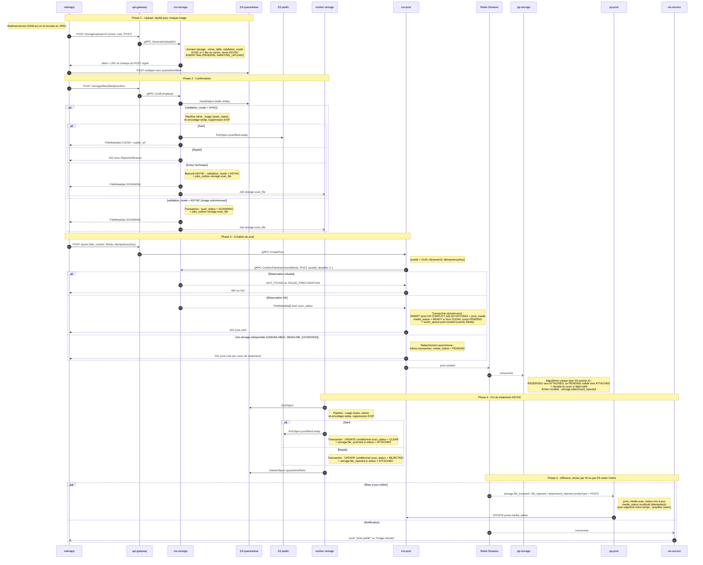
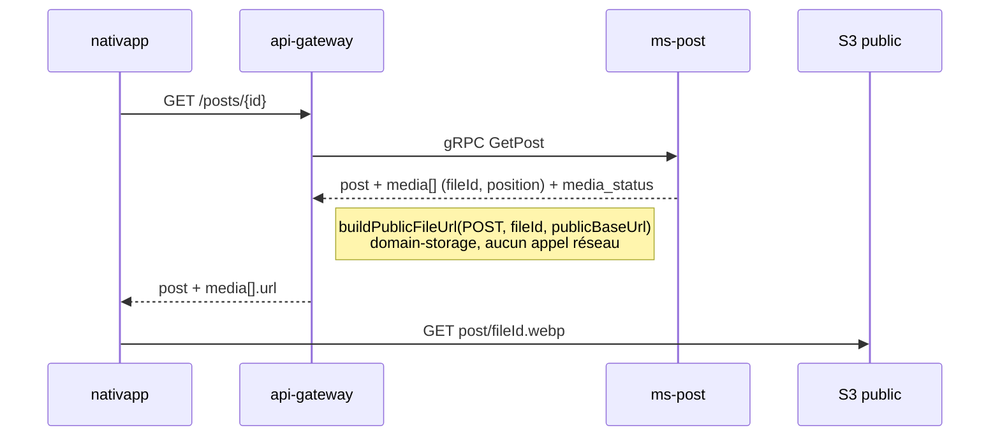

# 04 - Flux Post

**Cas d'usage** : un utilisateur publie un post avec une à dix images.

**Règle produit** : l'image est le contenu du post. Un post dont les médias ne sont pas encore validés n'est **pas visible** des autres utilisateurs (`media_status = PENDING`). Son auteur le voit avec un indicateur "en cours de traitement".

**Modes** ([02-architecture-cible.md](02-architecture-cible.md), section 3) :

- Traitement : SYNC par défaut (image de 1 Mo ou moins après redimensionnement client), ASYNC si l'image est plus volumineuse ou si le traitement synchrone échoue techniquement.
- Rattachement : `ConfirmFileAttachment` synchrone par défaut, rattachement asynchrone par `pp-storage` si `ms-storage` est indisponible.

## 1. Diagramme de séquence

## 2. Règles

- **Sans image** : `fileIds` vide, `ConfirmFileAttachment` n'est pas appelé, `media_status = NONE`.
- **Cas nominal** : images de 1 Mo ou moins, `ms-storage` disponible. Les images sont `CLEAN` dès la confirmation, la réservation renvoie `CLEAN`, le post est créé directement en `READY`. Aucune attente pour l'utilisateur.
- **Ordre des images** : conservé par `post_media.position`.
- **Agrégation** : `pp-post` met à jour `post_media.scan_status` pour le fichier reçu, puis recalcule `media_status` :
  - un média `REJECTED` (contenu refusé ou `storage.attachment_rejected`) : `REJECTED` ;
  - tous les médias `CLEAN` : `READY` ;
  - sinon : `PENDING`.

  La mise à jour et le recalcul sont idempotents : recevoir deux fois le même événement ne change rien.
- **Rattachement asynchrone** : le post est écrit sans validation préalable des fichiers. `pp-storage` les valide à réception de `post.created`. Un fichier invalide produit `storage.attachment_rejected`, et le post passe `REJECTED` sans avoir jamais été visible.
- **Réessai client après une erreur 5xx** : la même `idempotencyKey` donne le même `postId`. La réservation est reconnue comme "même entité" et l'insertion (`ON CONFLICT (id) DO NOTHING`) renvoie le post existant sans réémettre `post.created`.
- **Média rejeté** : le post passe `media_status = REJECTED` et reste invisible pour les autres. L'auteur est notifié et peut supprimer le post. La modification des médias d'un post existant n'est pas prévue au MVP.
- **Suppression du post** : `post.deleted` (existant) est consommé par `pp-storage`, qui libère les fichiers du post et écrit une pierre tombale.
- **Échec de la saga de création** : `post.creation_failed` est émis par `ws-service` (agrégation Scatter-Gather, `base-gather.post-processor.ts`) sur le stream `ws:post-created-feedback`, partagé avec d'autres types. `pp-storage` s'y abonne, filtre sur le type `post.creation_failed` et libère les fichiers du post. Aucun consommateur ne passe aujourd'hui un post en `CANCEL` : le post reste en `saga_status = PENDING`.

Les scénarios de panne détaillés sont dans [11-scenarios-de-panne.md](11-scenarios-de-panne.md).

## 3. Visibilité

Le filtre `media_status IN (NONE, READY)` s'applique pour tout lecteur qui n'est pas l'auteur, dans les requêtes de lecture de `domain-post` : `findById`, `listPaginated`, `search`. Le fil d'actualité renvoie des ids depuis `ms-social` (alimenté par `post.created`), hydratés par `ms-post` : les posts non visibles sont écartés à cette étape. Voir [02-architecture-cible.md](02-architecture-cible.md), section 6.

## 4. Lecture d'un post

Tant que `media_status != READY`, l'auteur reçoit les `fileId` sans URL, et le front affiche un indicateur de traitement.
