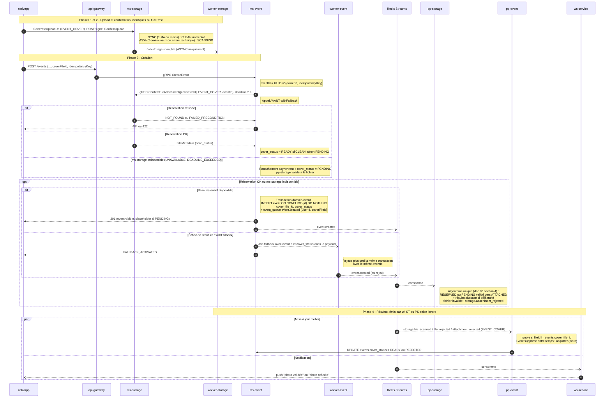
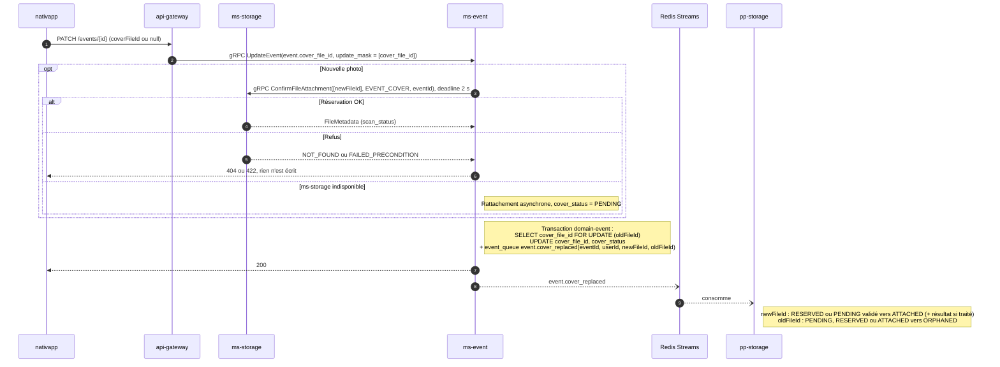

# 05 - Flux Event, photo de l'événement

**Cas d'usage** : un organisateur ajoute ou remplace la photo d'un événement, à la création ou plus tard.

**Règle produit (proposée, à valider)** : la photo décore l'événement, elle n'en est pas le contenu. L'événement est **visible immédiatement**. Tant que la photo n'est pas validée (`cover_status != READY`), le front affiche un placeholder.

**Modes** ([02-architecture-cible.md](02-architecture-cible.md), section 3) : traitement SYNC par défaut, ASYNC si la photo est volumineuse ou si le traitement synchrone échoue techniquement. Rattachement synchrone par défaut, asynchrone si `ms-storage` est indisponible.

> [!NOTE]
> `ms-event` ne contient aujourd'hui aucun champ image, ni dans le code ni dans `event.proto`. La création passe par `withFallback`, qui peut rejouer l'insertion depuis `worker-event` plusieurs minutes plus tard. Ce fallback couvre l'échec de l'opération d'écriture, **pas** l'indisponibilité de la base : il écrit son job dans la même base (`base.command.controller.ts`). Il est indépendant du rattachement asynchrone (`ms-storage` indisponible) : les deux peuvent se combiner.

## 1. Création d'un événement avec photo

## 2. Remplacement ou suppression de la photo

`UpdateEventCommand` fonctionne avec `Event event` + `update_mask`. Le champ `cover_file_id` est ajouté **uniquement dans `Event`** et adressé par le masque, pour ne pas créer un second chemin de mise à jour.

## 3. Règles

- **Lecture de l'ancienne photo sous verrou** : `oldFileId` est lu avec `SELECT ... FOR UPDATE` dans la transaction qui écrit `event.cover_replaced`. Deux remplacements simultanés produisent ainsi deux événements chaînés (A vers B, puis B vers C), et aucun fichier intermédiaire n'échappe à la libération.
- **Même photo renvoyée** : si `cover_file_id` ne change pas, `domain-event` n'écrit ni mise à jour ni `event.cover_replaced`.
- **Photo invalide en rattachement asynchrone** : `storage.attachment_rejected` conduit `pp-event` à passer `cover_status = REJECTED` (si le `fileId` est toujours le `cover_file_id` courant). La photo n'a jamais été affichée.
- **Photo rejetée** : `cover_status = REJECTED`, l'événement reste visible avec le placeholder. L'organisateur est notifié et peut envoyer une autre photo.
- **Remplacement pendant le scan** : `pp-event` ignore les résultats de scan dont le `fileId` n'est plus le `cover_file_id` courant.
- **Suppression de la photo** : `cover_file_id = null` via le masque, `cover_status = NONE`, `event.cover_replaced` émis avec `newFileId` absent.
- **Suppression de l'événement** : `event.deleted` (existant) est consommé par `pp-storage`, qui libère la photo et écrit une pierre tombale.

Les scénarios de panne détaillés sont dans [11-scenarios-de-panne.md](11-scenarios-de-panne.md).
- **Échec de la saga de création** : `event.creation_failed` est émis par `ws-service` (agrégation Scatter-Gather) sur le stream `ws:event-created-feedback`, partagé avec d'autres types. `pp-storage` filtre sur le type, comme le fait déjà `pp-event` (`event-creation-failed-options.ts`), et libère la photo. `pp-event` passe l'événement en `saga_status = CANCEL`.
- **Saga** : `cover_status` est une colonne distincte de `saga_status`. Elles ne doivent pas être confondues.
