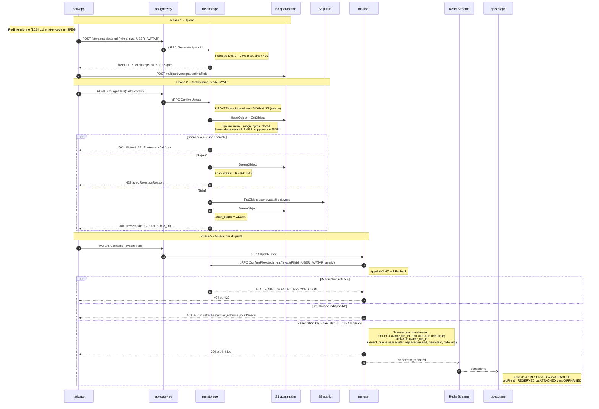
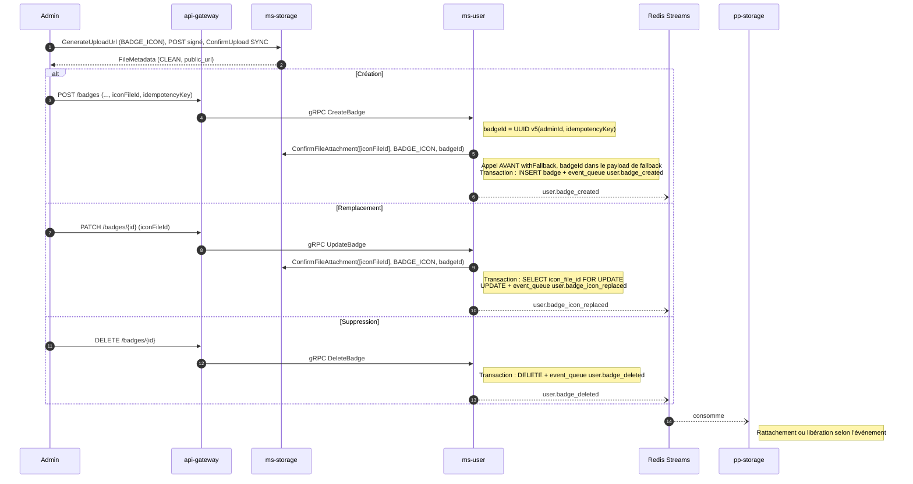

# 06 - Flux Avatar et Badge (mode SYNC)

Les petites images sont validées **pendant** `ConfirmUpload`. Au moment où le service métier les rattache, elles sont forcément `CLEAN` : aucun statut intermédiaire n'est nécessaire côté métier.

**Pas de mode asynchrone** pour ces deux types ([02-architecture-cible.md](02-architecture-cible.md), section 3) : la taille maximale (1 Mo) est égale au seuil SYNC, et `ms-user` n'a pas de statut média qui permettrait d'attendre une validation. En conséquence :

- erreur technique pendant le traitement synchrone : le fichier repasse en attente d'upload (échéance repoussée) et `ms-storage` répond 503 ;
- `ms-storage` indisponible au moment de `ConfirmFileAttachment` (`UNAVAILABLE`, `DEADLINE_EXCEEDED`) : `ms-user` répond 503, le profil n'est pas modifié, le client réessaie.

## 1. Photo de profil

**Champ** : `users.avatar_file_id` remplace `users.logo_path`. `logo_path` est déprécié dans `SignUpCommand`, `UpdateUserCommand`, `User`, `UserPublic` et `IUserPayload` ([08-contrats-et-evolutions.md](08-contrats-et-evolutions.md)). L'avatar ne se définit pas à l'inscription : il se définit ensuite par mise à jour du profil.

### Règles

- **Même avatar renvoyé** : si `avatar_file_id` ne change pas, `domain-user` n'écrit ni mise à jour ni `user.avatar_replaced`.
- **Affichage immédiat** : le front peut afficher l'avatar dès l'étape 2 grâce à `public_url`.
- **Fallback existant** : `updateUser` passe par `withFallback(UserJobType.FALLBACK_UPDATE_USER, ...)`. `ConfirmFileAttachment` reste **avant** ce bloc pour renvoyer le 422 en synchrone. Le payload de fallback transporte `avatarFileId`, et le rejeu écrit `user.avatar_replaced` dans sa transaction.
- **Outbox à ajouter dans `domain-user`** : la méthode `update` de `postgres-user.repository.ts` n'écrit aujourd'hui aucun événement. L'écriture de `user.avatar_replaced` dans la même transaction est un changement de `domain-user`, soumis à la règle du STOP.
- **Avatar confirmé mais jamais utilisé** : le fichier reste `PENDING` + `CLEAN`, purgé 24 h après sa confirmation.
- **Suppression de l'avatar** : `PATCH /users/me` avec `avatarFileId = null`, `user.avatar_replaced` émis avec `newFileId` absent.
- **Timeout** : le deadline gRPC de `ConfirmUpload` en mode SYNC doit couvrir le traitement d'un fichier de 1 Mo. Valeur à mesurer, proposition initiale 10 s côté gateway.
- **Format iOS** : le redimensionnement et le ré-encodage JPEG côté client évitent d'envoyer du HEIC.

## 2. Icône de badge (administration)

Les badges sont gérés par les administrateurs via `CreateBadgeCommand`, `UpdateBadgeCommand`, `DeleteBadgeCommand` (`user/user.command.proto`).

**Champ** : `badges.icon_file_id` remplace `icon_path`, déprécié dans `Badge`, `CreateBadgeCommand` et `UpdateBadgeCommand`. **SVG refusé** : les administrateurs fournissent un PNG ou un WebP.

### Règles

- **Propriété** : le propriétaire du fichier est l'administrateur qui l'a uploadé. Les icônes de badge sont des ressources de la plateforme : elles ne sont **pas** libérées quand le compte de cet administrateur est supprimé ([07-nettoyage-et-orphelins.md](07-nettoyage-et-orphelins.md)).
- **Fallback** : la création de badge passe par `withFallback` (`badge.command.controller.ts`). `ConfirmFileAttachment` est appelé avant, et le `badgeId` calculé est transporté dans le payload de fallback.
- **Même icône renvoyée** : aucune écriture si `icon_file_id` ne change pas.
- **Trois événements à créer** : `user.badge_created`, `user.badge_icon_replaced`, `user.badge_deleted`. `BadgeService` n'en émet aucun aujourd'hui.
