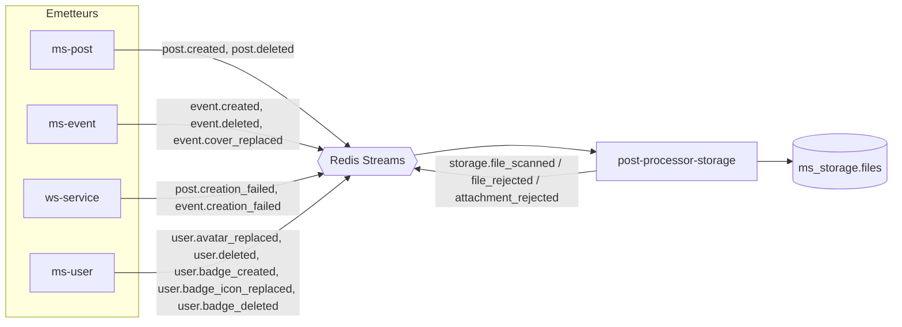
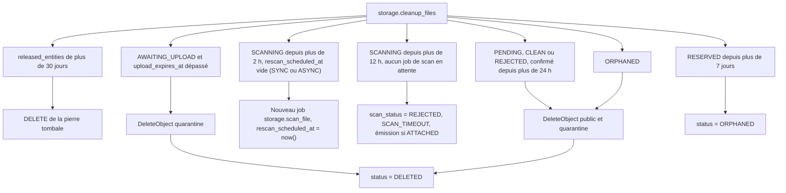

# 07 - Nettoyage et orphelins

Le nettoyage repose sur trois mécanismes complémentaires :

1. **Rattachement et libération par événements** (`post-processor-storage`) : réagit aux créations, remplacements, suppressions, échecs de saga et suppressions de compte.
2. **Purge périodique** (`worker-storage`, job `storage.cleanup_files`) : traite les expirations et supprime les objets S3.
3. **Règle de lifecycle S3** sur `quarantine/` : filet de sécurité.

## 1. Événements consommés par `post-processor-storage`



L'algorithme de rattachement est celui de [03-cycle-de-vie-fichier.md](03-cycle-de-vie-fichier.md), section 4 : il rattache un fichier `RESERVED` pour l'entité (chemin synchrone) ou valide puis rattache un fichier `PENDING` (chemin asynchrone, `ms-storage` indisponible au moment de la création).

| Événement reçu | Existant ? | Action |
| :--- | :--- | :--- |
| `post.created` | Oui, payload à enrichir (`fileIds`) | Rattacher les `fileIds` à `(POST, postId)` |
| `post.deleted` | Oui | Fichiers `RESERVED` / `ATTACHED` de `(POST, postId)` vers `ORPHANED` + pierre tombale |
| `post.creation_failed` | Oui, émis par `ws-service` sur `ws:post-created-feedback` (stream partagé, filtrer par type) | Idem `post.deleted` |
| `event.created` | Oui, payload à enrichir (`userId` obligatoire, `coverFileId`) | Rattacher `coverFileId` à `(EVENT_COVER, eventId)` |
| `event.deleted` | Oui | Fichier `RESERVED` / `ATTACHED` de `(EVENT_COVER, eventId)` vers `ORPHANED` + pierre tombale |
| `event.creation_failed` | Oui, émis par `ws-service` sur `ws:event-created-feedback` (stream partagé, filtrer par type) | Idem `event.deleted` |
| `event.cover_replaced` | Non, à créer | Rattacher `newFileId`, libérer `oldFileId` (fichier nommé) |
| `user.avatar_replaced` | Non, à créer | Rattacher `newFileId`, libérer `oldFileId` |
| `user.badge_created` | Non, à créer | Rattacher `iconFileId` à `(BADGE_ICON, badgeId)` |
| `user.badge_icon_replaced` | Non, à créer | Rattacher `newFileId`, libérer `oldFileId` |
| `user.badge_deleted` | Non, à créer | Fichier de `(BADGE_ICON, badgeId)` vers `ORPHANED` + pierre tombale |
| `user.deleted` | Type déclaré, **émetteur à créer** | Voir section 2 |

Événements **émis** par `pp-storage`, dans la transaction du rattachement :

| Événement | Quand |
| :--- | :--- |
| `storage.file_scanned` / `storage.file_rejected` | Fichier rattaché dont le traitement est déjà terminé (règle d'émission, doc 03 section 4) |
| `storage.attachment_rejected` | Rattachement asynchrone refusé : fichier inconnu, d'un autre propriétaire, de mauvais type, rejeté, non confirmé ou déjà rattaché ailleurs |

Règles communes (détaillées dans [03-cycle-de-vie-fichier.md](03-cycle-de-vie-fichier.md), sections 4 et 6) :

- Rattachement depuis `RESERVED` (même entité) ou, après validation, depuis `PENDING`. Libération par entité depuis `RESERVED` ou `ATTACHED`, avec pierre tombale dans `released_entities`. Libération d'un fichier nommé depuis `PENDING`, `RESERVED` ou `ATTACHED`. `ORPHANED` est absorbant.
- Un rattachement qui trouve une pierre tombale pour son entité libère les fichiers nommés au lieu de les rattacher.
- Un `*_replaced` avec `oldFileId = newFileId` ne libère rien (défense, le service métier ne doit pas l'émettre).
- Toutes les actions sont des `UPDATE` conditionnels : rejouer un événement ne change rien.
- `pp-storage` n'appelle aucun service et ne touche pas S3 : il ne dépend que de la base `ms_storage`, pas du service `ms-storage`.

## 2. Suppression de compte (`user.deleted`)

Aujourd'hui, `UserService.delete` (`domain-user/src/services/user.service.ts`) supprime l'utilisateur sans émettre `user.deleted`, alors que `post-processor-social` et `ws-service` consomment déjà cet événement.

À créer dans `domain-user` : écriture de `user.deleted` dans `event_queue`, dans la même transaction que la suppression. Le payload existant de `messaging` (`id`, `role`) est réutilisé.

Action de `pp-storage` :

```sql
UPDATE files
SET status = 'ORPHANED'
WHERE owner_id = $1
  AND entity_type <> 'BADGE_ICON'
  AND status IN ('PENDING', 'RESERVED', 'ATTACHED');
```

- **Tous les fichiers du compte sont libérés** (avatar, images de posts, photos d'événements, uploads non rattachés), ce qui couvre l'effacement des données personnelles.
- **Les icônes de badge sont exclues** : ce sont des ressources de la plateforme, elles ne disparaissent pas avec le compte de l'administrateur qui les a uploadées.
- **Couvre aussi `deleteByAuthorId`** (`postgres-post.repository.ts`), qui supprime des posts sans émettre `post.deleted` : leurs fichiers sont libérés par le balayage sur `owner_id`.
- **Effet de bord à tester** : émettre `user.deleted` réveille aussi les consommateurs existants, la saga de suppression côté `ws-service` (`expects: ["USER_SOCIAL_DELETED"]`) et `UserDeletedPostProcessor` dans `post-processor-social`. À valider en vague 6.
- **Décision ouverte** : si les posts ou événements d'un utilisateur supprimé doivent survivre (anonymisés), leurs images disparaîtront quand même. À valider avec le produit et la politique RGPD.

## 3. Purge périodique

Job `storage.cleanup_files` exécuté par `worker-storage`, toutes les 15 minutes (proposition).



Règles :

- Traitement par lots (`LIMIT` + `FOR UPDATE SKIP LOCKED`) pour supporter plusieurs instances.
- Pour un passage en `DELETED`, la purge supprime d'abord les objets S3, puis passe la ligne en `DELETED`. Un crash entre les deux laisse une ligne non `DELETED` sans objet, reprise au passage suivant (un `DeleteObject` sur un objet absent renvoie un succès). L'ordre inverse ferait fuir l'objet.
- Les lignes ne sont jamais supprimées : elles passent `DELETED` (audit). Une purge SQL des lignes `DELETED` anciennes pourra être ajoutée plus tard.
- Un `RESERVED` de plus de 7 jours correspond à une entité jamais écrite (échec définitif après réservation). Le passage en `ORPHANED` est sûr : si l'entité était écrite, l'événement de confirmation l'aurait rattaché depuis longtemps.

### Déclenchement

Aucun pattern de job répétable n'existe dans `workers-runners`. Recommandation : un `CronJob` Kubernetes (dépôt `deploy`) qui exécute une commande de `ms-storage` dont le seul rôle est d'écrire un job `storage.cleanup_files` dans `jobs_outbox`. Le job suit ensuite le circuit standard (outbox, BullMQ, worker, `job_audit`). En local, le même script se lance à la main ou depuis `ci-tools`.

## 4. Règle de lifecycle S3

Sur `volontariapp-private`, préfixe `quarantine/` : expiration des objets après 1 jour. À ajouter dans `ci-tools/scripts/init-buckets.sh` (local) et dans la configuration du stockage de production. Ce délai est supérieur aux 12 h du `SCAN_TIMEOUT` : la règle ne supprime jamais un objet encore en cours de traitement normal.
