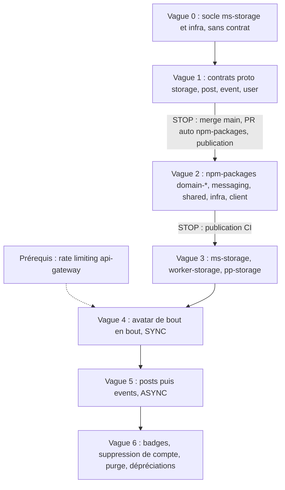

# 10 - Plan d'implémentation

Le plan est découpé en vagues. Toute vague qui touche `proto-registry` ou `npm-packages` se termine par un **STOP** : publication par la CI obligatoire avant de toucher les consommateurs (`.agents/AGENTS.md`, section 1).

## Périmètre MVP : les cas de succès d'abord

Objectif : faire fonctionner de bout en bout le traitement SYNC, le traitement ASYNC et le rattachement asynchrone quand `ms-storage` est indisponible. Les scénarios d'échec, de reprise et de purge viennent ensuite (problèmes P1 à P7 de [11-scenarios-de-panne.md](11-scenarios-de-panne.md), section 3).

### Critères de réussite (démonstration)

| # | Scénario | Résultat attendu |
| :--- | :--- | :--- |
| 1 | Avatar de 1 Mo ou moins | `ConfirmUpload` renvoie `CLEAN` + `public_url`, `PATCH /users/me` rattache, l'avatar s'affiche |
| 2 | Post avec images de 1 Mo ou moins | Post créé directement en `READY`, visible de tous |
| 3 | Post avec une image de plus de 1 Mo | Post créé en `PENDING`, invisible des autres, puis `READY` après le job `storage.scan_file`, notification au propriétaire |
| 4 | Événement avec photo, `ms-storage` arrêté au moment de `CreateEvent` (photo déjà confirmée) | Événement créé avec placeholder, `pp-storage` rattache via `event.created`, `cover_status` passe `READY` |
| 5 | Même chose qu'en 4 pour un post | Post créé en `PENDING`, rattaché par `pp-storage`, puis `READY` |
| 6 | `fileId` d'un autre utilisateur | 404 en synchrone. En rattachement asynchrone : `storage.attachment_rejected`, l'image n'est jamais affichée |

### Dans le MVP

- Vagues 0 à 2 (socle, contrats, packages), avec les règles de la STOP. Les contrats sont livrés en entier pour éviter un second cycle STOP, même si une partie n'est utilisée qu'après le MVP.
- Vague 3 sans la purge : `ms-storage` (handlers, SYNC, ASYNC, bascule technique), `worker-storage` (`storage.scan_file`), `post-processor-storage` (rattachement synchrone et asynchrone, `storage.attachment_rejected`, libération sur `post.deleted` / `event.deleted` / `*_replaced`).
- Vague 4 (avatar) et vague 5 (posts puis événements, avec le rattachement asynchrone).

### Reporté après le MVP

- Pierres tombales (`released_entities`) et verrou par entité (P1) : la table peut être créée, la logique attend.
- Purge `storage.cleanup_files`, relance des `SCANNING` bloqués, `SCAN_TIMEOUT` (P3), `CronJob`, lifecycle S3 de production.
- Reprise des événements en DLQ (P2), bug `job:outbox:failure` (P4), fallback sur base indisponible (P5), points P6 et P7 et mineurs.
- Badges, émission de `user.deleted`, échecs de saga (`*.creation_failed`).
- Rate limiting de la gateway : requis avant la production, pas avant le développement.

## Prérequis - Rate limiting de la gateway

Aucun throttler n'existe dans `api-gateway`. C'est un chantier à part entière, à mener en parallèle. Il doit être en place avant l'ouverture des routes `/storage/*` en production (vague 4).

## Vague 0 - Socle `ms-storage` et infrastructure (aucun contrat touché)

- [ ] `ms-storage/src/main.ts` : modèle hybride de `ms-post` (`connectMicroservice(getGrpcOptions(GRPC_MICROSERVICES.STORAGE, msStorageUrl))` puis `app.listen(3006)` pour `/health`). `GRPC_MICROSERVICES.STORAGE` existe déjà.
- [ ] Configuration : `microServices.msStorageUrl`, `s3.publicEndpoint`, `s3.privateBucket`, `s3.publicBaseUrl`, `scanner.*`.
- [ ] Importer `S3Module` dans `AppModule`.
- [ ] `ci-tools/docker-compose.yml` : variables `S3_*` et `MS_STORAGE_URL` pour `ms-storage`, `S3_SECRET_KEY` aligné sur `MINIO_ROOT_PASSWORD`, conteneur clamd.
- [ ] `ci-tools/scripts/init-buckets.sh` : politique anonyme limitée à `s3:GetObject` (vérifier d'abord la politique actuelle avec `mc anonymous get-json`), lifecycle `quarantine/` à 1 jour.
- [ ] `sync-migrations.sh` : ajouter `storage`.

## Vague 1 - Contrats Protobuf

Skill : `proto-contract-evolution`. Détail dans [08-contrats-et-evolutions.md](08-contrats-et-evolutions.md), sections 1 et 2.

- [ ] `storage` : `FileStatus.RESERVED`, `ScanStatus`, `RejectionReason`, `ValidationMode`, champs 12 à 15 de `FileMetadata`, `ConfirmUpload`, `upload_fields`, `ConfirmFileAttachmentResponse.files`, dépréciations (`is_public`, `VerifyFilesExist`).
- [ ] `post` : `file_ids`, `idempotency_key`, `PostMedia`, `PostMediaStatus`.
- [ ] `event` : `cover_file_id`, `idempotency_key`, `CoverStatus`.
- [ ] `user` : `avatar_file_id`, dépréciation de `logo_path`, `icon_file_id`, `idempotency_key` sur `CreateBadgeCommand`, dépréciation de `icon_path`.
- [ ] Numéros de champs fixés explicitement ([08-contrats-et-evolutions.md](08-contrats-et-evolutions.md), section 2) et `reserved 5;` sur `CreateEventCommand`.
- [ ] `buf lint` et `buf breaking --against '.git#branch=main'`.
- [ ] **STOP** : merge sur `main`, la CI ouvre la PR de régénération de `contracts` / `contracts-nest` dans `npm-packages`, qui doit être mergée et publiée.

## Vague 2 - `npm-packages`

Skill : `shared-npm-package-change`. Détail dans [08-contrats-et-evolutions.md](08-contrats-et-evolutions.md), sections 3 à 7.

- [ ] `messaging` : domaine `storage` (jobs, queue, events dont `storage.attachment_rejected`), `post.created` enrichi (`fileIds`, `userId` obligatoire), `event.created` enrichi (`userId` obligatoire, `coverFileId`), `event.cover_replaced`, `user.avatar_replaced`, événements de badge, payloads de fallback avec ids, `IUserPayload.avatarFileId`.
- [ ] `shared` : enum `StorageStream` (dont `STORAGE_ATTACHMENT_REJECTED`) et nouveaux streams `event` / `user`, fusion dans `Streams`.
- [ ] `domain-storage` : enums, politiques (seuil SYNC, `asyncAllowed`, `resolveValidationMode`, SVG retiré), helpers, `FileModel`, table `released_entities`, `PostgresFileRepository` (règle de validation unique pour `reserve` et `attachFromConfirmationEvent`).
- [ ] `domain-post` : id fourni, `post_media`, `media_status`, création idempotente (`ON CONFLICT (id) DO NOTHING`, sans réémission de `post.created`), filtre de visibilité, mise à jour des statuts médias.
- [ ] `domain-event` : id fourni, `cover_file_id`, `cover_status`, `event.cover_replaced` sous verrou.
- [ ] `domain-user` : `avatar_file_id` + `user.avatar_replaced`, émission de `user.deleted` dans `delete`, badges (`icon_file_id`, id fourni, trois événements).
- [ ] Package d'infrastructure storage (pipeline).
- [ ] Package client gRPC storage.
- [ ] `yarn build`, `yarn test`, `yarn changeset add` pour chaque package.
- [ ] **STOP** : publication par la CI.

## Vague 3 - Backend storage

Skills : `file-storage-flow`, `implement-async-job-flow`, `implement-async-event-flow`.

- [ ] `ms-storage` : migrations `files` et `released_entities`, handlers `GenerateUploadUrl` (POST signé, calcul de `validation_mode`), `ConfirmUpload` (SYNC par défaut, ASYNC si volumineux, bascule ASYNC sur erreur technique, idempotent), `ConfirmFileAttachment` (réservation), `GetFileMetadata`, `DeleteFile`, `VerifyFilesExist` (compatibilité).
- [ ] `worker-storage` : handler `storage.scan_file` (mise à jour conditionnelle, règle d'émission), handler `storage.cleanup_files`.
- [ ] `post-processor-storage` : algorithme unique de rattachement (synchrone et asynchrone, pierres tombales, `storage.attachment_rejected`) et consommateurs listés dans [07-nettoyage-et-orphelins.md](07-nettoyage-et-orphelins.md), section 1.
- [ ] Tests d'intégration avec MinIO et clamd, dont les deux ordres de la section 4 du doc 03 et les ordres de la section 6. Scénarios de panne de [11-scenarios-de-panne.md](11-scenarios-de-panne.md) : clamd arrêté (bascule ASYNC), `ms-storage` arrêté pendant une création (rattachement asynchrone), crash pendant un traitement SYNC.

## Vague 4 - Premier flux de bout en bout : avatar (SYNC)

- [ ] `api-gateway` : module storage (`POST /storage/upload-url`, `POST /storage/files/{id}/confirm`, `GET /storage/files/{id}`), relais de `avatarFileId`, URL d'avatar calculée, deadline de 10 s sur `ConfirmUpload`.
- [ ] `ms-user` : client storage partagé, `ConfirmFileAttachment` avant `withFallback`, payload de fallback avec `avatarFileId`. `UNAVAILABLE` / `DEADLINE_EXCEEDED` : 503, pas de rattachement asynchrone.
- [ ] `nativapp` : client API storage, mutation React Query `useUploadFile(entityType)` (redimensionnement et ré-encodage JPEG, POST multipart signé, confirmation), branchement dans `ProfileEditModal.tsx` à la place de l'alerte "Coming soon". La bibliothèque de redimensionnement et sa version sont à choisir selon la version d'Expo du projet.

## Vague 5 - Flux ASYNC : posts puis events

- [ ] `api-gateway` : relais de `fileIds`, `coverFileId`, `idempotencyKey`, URL des médias.
- [ ] `ms-post` : id UUID v5, client storage partagé (deadline 2 s), création avec médias, rattachement asynchrone sur `UNAVAILABLE` / `DEADLINE_EXCEEDED` (`media_status = PENDING`).
- [ ] `pp-post` : consommation de `storage.file_scanned` / `storage.file_rejected` / `storage.attachment_rejected`, acquittement avec `warn` si le post a été supprimé.
- [ ] `ms-event` : id UUID v5, `ConfirmFileAttachment` (deadline 2 s) avant `withFallback`, rattachement asynchrone sur `UNAVAILABLE` / `DEADLINE_EXCEEDED`, `cover_file_id` via `Event` + `update_mask`.
- [ ] `worker-event` : fallback de création avec l'id calculé.
- [ ] `pp-event` : consommation des résultats et de `storage.attachment_rejected`, filtre sur le `cover_file_id` courant, acquittement avec `warn` si l'événement a été supprimé.
- [ ] `ws-service` : notifications au propriétaire.
- [ ] `nativapp` : états "en cours de traitement", placeholder, rejets, envoi de `idempotencyKey` (générée une fois par formulaire, réutilisée en cas de réessai).

## Vague 6 - Badges, suppression de compte, purge, dépréciations

- [ ] `ms-user` / `api-gateway` : flux d'icône de badge pour les administrateurs.
- [ ] `ms-user` : vérifier que `deleteUser` (et son fallback) émet bien `user.deleted` après la vague 2, et tester l'effet sur les consommateurs existants (saga de suppression de `ws-service`, `post-processor-social`).
- [ ] Déclenchement de `storage.cleanup_files` (`CronJob` Kubernetes dans `deploy`, voir [07-nettoyage-et-orphelins.md](07-nettoyage-et-orphelins.md), section 3).
- [ ] Lifecycle `quarantine/` et politique anonyme du bucket public en production.
- [ ] Migration de `ms-post` / `ms-user` vers le client partagé, suppression des deux `StorageClientService`, puis suppression de `VerifyFilesExist` (changement cassant, nouvelle vague proto).
- [ ] Audit des données existantes de `logo_path` / `icon_path`, migration éventuelle, puis suppression des champs dépréciés.
