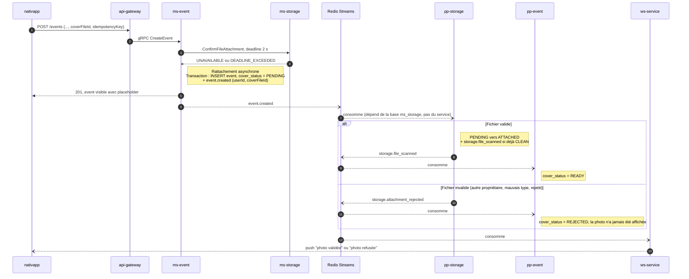

# 11 - Scénarios de panne

Ce document rassemble le comportement attendu quand un composant est indisponible ou crashe. Principe général : **synchrone par défaut, asynchrone dès qu'un composant de stockage fait défaut**, sauf pour l'avatar et le badge, qui n'ont pas de statut d'attente côté métier et renvoient 503.

## 1. Scénario de référence : créer un événement avec photo, `ms-storage` indisponible

L'organisateur a déjà uploadé et confirmé sa photo (`ms-storage` était disponible). Au moment de créer l'événement, `ms-storage` ne répond plus.

Résultat : l'organisateur crée son événement sans erreur, la photo apparaît dès que la validation asynchrone aboutit. `ms-event` ne dépend de `ms-storage` que pendant 2 s au maximum.

Variante : si l'écriture de l'événement échoue dans `ms-event`, `withFallback` prend le relais avec le même `eventId`. `event.created` est émis au rejeu par `worker-event`, et la suite est identique. Si la base de `ms-event` est entièrement indisponible, le fallback échoue aussi (il écrit dans la même base) : voir le problème P5 en section 3.

## 2. Matrice des scénarios

### Phase d'upload

| Panne | Impact utilisateur | Comportement | Reprise |
| :--- | :--- | :--- | :--- |
| `ms-storage` indisponible à `GenerateUploadUrl` | Impossible d'ajouter une image | Gateway : 503 | Le front propose de réessayer ou de publier sans image (l'image pourra être ajoutée plus tard pour un événement ou un avatar) |
| MinIO / S3 indisponible pendant l'upload | Échec de l'envoi | Erreur réseau côté client | Réessai de l'upload tant que l'URL est valide (15 min), sinon nouvelle URL |
| Réseau du client coupé entre l'upload et la confirmation | Aucun tant que le client réessaie | Fichier `AWAITING_UPLOAD` | `ConfirmUpload` est idempotent, le client le rejoue. Sans confirmation avant `upload_expires_at`, la purge supprime le fichier |
| `ms-storage` indisponible à `ConfirmUpload` | Confirmation impossible | Gateway : 503 | Réessai client avant `upload_expires_at` |

### Phase de traitement

| Panne | Impact utilisateur | Comportement | Reprise |
| :--- | :--- | :--- | :--- |
| clamd ou S3 indisponible pendant un traitement SYNC (post, event) | Image "en cours de traitement" au lieu de prête | Bascule ASYNC : job `storage.scan_file` | BullMQ fait 3 tentatives sur environ 7 s (`attempts: 3`, backoff exponentiel de 1 s). Au-delà, relance unique par la purge après 2 h (P3) |
| clamd ou S3 indisponible pendant un traitement SYNC (avatar, badge) | Échec de la confirmation | Retour en attente d'upload (échéance repoussée de 15 min), 503 | Réessai client |
| Crash de `ms-storage` pendant un traitement SYNC | Pas de réponse | Fichier bloqué en `SCANNING` | La purge relance un job ASYNC après 2 h (une fois) |
| `worker-storage` indisponible | Images volumineuses en attente | Jobs conservés dans `jobs_outbox` et BullMQ | Traitement au redémarrage. Voir P3 (section 3) |
| `outbox-storage` indisponible | Images volumineuses et résultats en attente | Jobs et événements conservés dans `jobs_outbox` / `event_queue` | Publication au redémarrage, aucune perte |

### Phase de rattachement

| Panne | Impact utilisateur | Comportement | Reprise |
| :--- | :--- | :--- | :--- |
| `ms-storage` indisponible à `ConfirmFileAttachment` (post, event) | Aucun : entité créée, image en traitement | Rattachement asynchrone (section 1) | Validation par `pp-storage` |
| `ms-storage` indisponible à `ConfirmFileAttachment` (avatar, badge) | Échec de la mise à jour | 503, rien n'est écrit | Réessai client |
| `ConfirmFileAttachment` expire alors que le serveur a validé | Aucun | Le service métier part en asynchrone, le fichier est déjà `RESERVED` pour l'entité | `pp-storage` reconnaît "même entité" et rattache |
| Base `ms_storage` indisponible | `ms-storage` indisponible (voir ci-dessus) | `pp-storage` échoue : 3 tentatives (`maxRetries: 3`, environ 3 s), puis DLQ et acquittement. **Événement perdu** | Aucune reprise automatique aujourd'hui (P2) |
| `post-processor-storage` indisponible | Images "en cours de traitement" plus longtemps | Événements de confirmation conservés dans les streams | Traitement au redémarrage. Voir P2 (section 3) |
| Échec d'écriture dans `ms-event` (ou `ms-post`, `ms-user`) | Réponse `FALLBACK_ACTIVATED` | `withFallback` rejoue la création avec le même id | Rejeu par le worker du domaine. Base entièrement indisponible : non couvert (P5) |

### Phase de diffusion

| Panne | Impact utilisateur | Comportement | Reprise |
| :--- | :--- | :--- | :--- |
| `pp-post` / `pp-event` indisponible | Entité affichée "en cours de traitement" plus longtemps | Résultats conservés dans les streams | Mise à jour au redémarrage (idempotente) |
| `ws-service` indisponible | Pas de notification temps réel | Aucun impact métier | Le front relit l'état de l'entité (React Query) |
| Redis indisponible | Traitements ASYNC et rattachements asynchrones en pause | Jobs et événements conservés dans les tables outbox PostgreSQL | Publication au retour de Redis |

### Côté client

| Situation | Comportement |
| :--- | :--- |
| Double appui sur "Publier" | Même `idempotencyKey`, donc même id d'entité : réservation "même entité" et insertion `ON CONFLICT (id) DO NOTHING` |
| Réessai après un 5xx | Idem |
| Application fermée pendant le traitement ASYNC | Aucun impact, l'état est relu à la réouverture |

## 3. Problèmes connus, reportés après le MVP

Issus de la dernière revue. Aucun ne bloque les cas de succès (traitement SYNC, traitement ASYNC, rattachement asynchrone quand `ms-storage` est indisponible) : ils concernent des pannes, des courses rares ou la purge. Chaque point indique la correction prévue.

### Importants

| # | Problème | Impact | Correction prévue |
| :--- | :--- | :--- | :--- |
| P1 | **Pierre tombale non atomique** : `post.deleted` et `post.created` (chemin asynchrone) traités en parallèle par deux instances de `pp-storage`. La libération par entité ne voit pas les fichiers `PENDING` (`entity_id` NULL), et le rattachement lit `released_entities` avant le commit de l'autre transaction. | Fichiers rattachés à une entité supprimée, images publiques conservées | Verrou par entité `pg_advisory_xact_lock(hashtext(entity_type || ':' || entity_id))` en début de transaction, dans la libération par entité et dans le rattachement |
| P2 | **Perte d'événements en DLQ** : `BatchPostProcessor` fait `maxRetries` tentatives (3 pour `pp-storage`), puis envoie en DLQ et acquitte. La DLQ est vidée après 24 h, sans rejeu. **Concerne tous les post-processors de la plateforme.** | Une coupure de quelques secondes de `ms_storage` peut perdre un `post.created` : image supprimée par la purge 7 jours (ou 24 h) plus tard | Dans `@volontariapp/post-processors` : ne pas compter les erreurs d'infrastructure comme des tentatives (laisser le message dans la PEL), ou tentatives longues + outil de rejeu de la DLQ |
| P3 | **Garde de `SCAN_TIMEOUT` inopérante** : `jobs_outbox` passe `COMPLETED` dès le push BullMQ (`outbox.consumer.ts`), un job en attente dans BullMQ n'y est donc plus visible. BullMQ ne fait que 3 tentatives sur environ 7 s. | Après une longue panne de `worker-storage` ou de clamd, rejet possible d'images légitimes, ou fichier jamais rejeté | Garde basée sur `job_audit` (pas de ligne terminale pour le job du fichier), plafond absolu de 24 h, `HeadObject` 404 traité comme rejet définitif dans le worker, `attempts` et backoff dédiés pour `storage-queue` |
| P4 | **Bug `job:outbox:failure`** : le trigger émet `*:job:outbox:failure`, `JobOutboxFailedPostProcessor` n'accepte que `*:job:outbox:failed`. De plus, son `UPDATE ... WHERE status = PENDING` ne toucherait rien, le job étant déjà `COMPLETED` depuis le push. | Aucun feedback d'échec de job sur toute la plateforme | Corriger le filtre et la condition dans `@volontariapp/post-processors` (ticket hors stockage) |
| P5 | **`withFallback` ne couvre pas une base indisponible** : le job de fallback est écrit dans la même base que l'entité. | Base `ms-event` / `ms-post` / `ms-user` indisponible : erreur, pas de fallback | Hors stockage : stockage du fallback hors de la base du service, ou accepter l'erreur |
| P6 | **Purge contre rattachement asynchrone** : si la purge relâche le verrou de ligne pendant les suppressions S3, un rattachement asynchrone peut rattacher un fichier dont l'objet public est en cours de suppression. | `READY` émis, image cassée | Garder `FOR UPDATE` jusqu'au commit pendant les appels S3, ou passer par un état intermédiaire conditionnel avant de supprimer |
| P7 | **Libération d'icône de badge** : la condition "appartient au propriétaire" ne s'applique pas (l'icône appartient à l'administrateur qui l'a uploadée, l'événement ne porte pas de propriétaire). | Ancienne icône jamais libérée | `RESERVED` / `ATTACHED` : condition sur `(entity_type, entity_id)`. `PENDING` : condition sur le propriétaire |

### Mineurs

- Fichier nommé libéré alors qu'il était `PENDING` : renseigner `entity_id`, sinon la relecture produit un `storage.attachment_rejected` parasite (sans effet, filtré par `pp-event`).
- Pierre tombale trouvée au rattachement : émettre `storage.attachment_rejected` avec la raison `ENTITY_RELEASED`, sinon une entité recréée avec la même clé d'idempotence reste `PENDING`.
- Timeout interne du pipeline SYNC inférieur au deadline gateway (10 s), sinon le client reçoit `DEADLINE_EXCEEDED` avant la bascule ASYNC.
- Relance d'un SYNC interrompu par la purge : passer aussi `validation_mode` à `ASYNC`.
- Diagrammes des docs 04 et 05 : l'émission de `post.created` / `event.created` est dessinée après le bloc `alt`, donc visuellement aussi dans la branche "refusée".

### Limites de conception

- **Panne prolongée de `ms-storage`** : le fallback asynchrone ne couvre que le rattachement. Sans `ms-storage`, aucune nouvelle image ne peut être uploadée. Réponse produit : permettre de publier sans image et de l'ajouter ensuite.
- **Délais de purge** : un rattachement asynchrone traité plus de 24 h (fichier `PENDING`) ou 7 jours (fichier `RESERVED`) après la création aboutit à `storage.attachment_rejected`.
