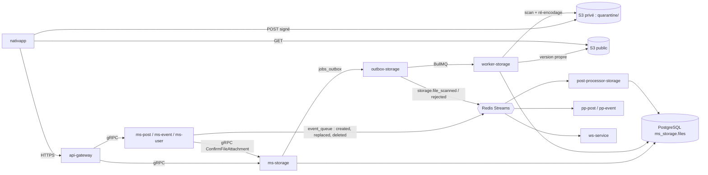

# Stockage de Fichiers - Architecture Cible

Ce dossier décrit l'architecture retenue pour le stockage des fichiers (images) dans Volontariapp : images de posts, photos d'événements, photos de profil et icônes de badges.

> [!NOTE]
> **Statut : Proposition (RFC), révisée après audit.** Le dossier décrit la cible. L'état réel du code au moment de la rédaction est détaillé dans [01-etat-des-lieux.md](01-etat-des-lieux.md). Les décisions encore ouvertes sont listées en bas de cette page.

## Principe en une phrase

Le client uploade **directement** sur S3 (MinIO en local) via une URL signée, vers une **quarantaine privée**. `ms-storage` est le **seul propriétaire** des fichiers (métadonnées, scan, cycle de vie). Les services métiers (`ms-post`, `ms-event`, `ms-user`) ne manipulent que des **`file_id`**, jamais d'octets ni d'URL stockées.

## Navigation

Lecture recommandée dans l'ordre :

| # | Document | Contenu |
| :--- | :--- | :--- |
| 01 | [État des lieux](01-etat-des-lieux.md) | Ce qui existe dans le code, ce qui manque, ce qui est cassé. |
| 02 | [Architecture cible](02-architecture-cible.md) | Composants, responsabilités, buckets, clés d'objets, modes SYNC / ASYNC, pipeline. |
| 03 | [Cycle de vie d'un fichier](03-cycle-de-vie-fichier.md) | `FileStatus`, `ScanStatus`, réservation, confirmation, règle d'émission du résultat, concurrence. |
| 04 | [Flux Post](04-flux-post.md) | Images d'un post (ASYNC, le post attend ses médias). |
| 05 | [Flux Event](05-flux-event.md) | Photo d'un événement (ASYNC, l'événement reste visible). |
| 06 | [Flux Avatar et Badge](06-flux-avatar.md) | Photo de profil et icône de badge (SYNC). |
| 07 | [Nettoyage et orphelins](07-nettoyage-et-orphelins.md) | Libération des fichiers, suppression de compte, purge, lifecycle S3. |
| 08 | [Contrats et évolutions](08-contrats-et-evolutions.md) | Protobuf, `messaging`, `shared`, `domain-*`, schéma SQL, configuration. |
| 09 | [Sécurité](09-securite.md) | Menaces, propriété, mapping des erreurs, traçabilité. |
| 10 | [Plan d'implémentation](10-plan-implementation.md) | Vagues de travail, respect de la règle du STOP. |
| 11 | [Scénarios de panne](11-scenarios-de-panne.md) | Comportement quand un composant est indisponible, limites connues. |

## Vue d'ensemble

## Décisions prises

1. **Upload direct S3 par POST signé** (policy `content-length-range`), signé avec un endpoint joignable par le téléphone. Les octets ne transitent jamais par `api-gateway` ni par les microservices.
2. **Un seul circuit d'upload. Traitement SYNC par défaut, ASYNC si le fichier est volumineux** (au-delà du seuil SYNC de son `EntityType`) **ou si le traitement synchrone échoue techniquement**. Le mode est décidé par `domain-storage` selon `EntityType` et la taille déclarée, jamais par le client. L'avatar et le badge restent toujours SYNC.
3. **Quarantaine obligatoire** : tout upload arrive dans le bucket privé. Seule une version scannée et ré-encodée est copiée dans le bucket public, qui n'autorise que `GetObject` anonyme.
4. **Les services métiers stockent des `file_id`**, jamais d'URL. L'URL publique est déterministe et calculée à la lecture.
5. **Rattachement synchrone par défaut, asynchrone si `ms-storage` est indisponible.** `ConfirmFileAttachment` réserve les fichiers (propriété, type, état vérifiés, idempotent, deadline 2 s). Si `ms-storage` ne répond pas, le post ou l'événement est créé quand même et `post-processor-storage` valide puis rattache les fichiers à partir de l'événement de création. Le rattachement définitif (`ATTACHED`) découle toujours de cet événement, émis dans la même transaction que l'écriture de l'entité.
6. **Les ids d'entités sont calculés avant l'écriture** à partir d'une clé d'idempotence fournie par le client. Ils survivent aux fallbacks et aux réessais.
7. **Le résultat du scan n'est diffusé que pour un fichier `ATTACHED`**, par celle des deux transitions (fin de scan, confirmation du rattachement) qui arrive en second. L'entité métier existe donc toujours quand son post-processor reçoit le résultat.
8. **Les transitions de rattachement sont commutatives** : l'ordre d'arrivée des événements entre streams n'a pas d'incidence sur l'état final.
9. **`post-processor-storage` est le point unique de rattachement et de libération** (création, remplacement, suppression, échec de saga, suppression de compte).
10. **Modèle et repository `files` dans `@volontariapp/domain-storage`**, comme pour les autres domaines. Le pipeline de traitement (S3, clamd, ré-encodage) vit dans un package d'infrastructure séparé.
11. **`avatar_file_id` remplace `logo_path`**, **`icon_file_id` remplace `icon_path`**. Les anciens champs sont dépréciés.
12. **SVG refusé** pour les icônes de badge. Les administrateurs fournissent un PNG.

## Décisions ouvertes

| Sujet | Proposition | Impact |
| :--- | :--- | :--- |
| Seuil de taille du mode SYNC | 1 Mo pour tous les types, à ajuster après mesure de la durée du pipeline | `domain-storage`, `nativapp` |
| Event pendant le scan de sa photo | Visible avec placeholder | `ms-event`, `pp-event`, front |
| Modification des médias d'un post existant | Non supportée au MVP | `ms-post` |
| Contenus d'un utilisateur supprimé | Tous ses fichiers sont libérés, sauf les icônes de badge | `pp-storage`, RGPD |
| Données existantes de `logo_path` / `icon_path` | Audit du contenu avant migration | `domain-user` |
| Déclenchement de la purge périodique | `CronJob` Kubernetes qui écrit un job dans `jobs_outbox` | `deploy`, `ms-storage` |
| Rate limiting de la gateway | Chantier préalable, inexistant aujourd'hui | `api-gateway` |

## Problèmes connus, reportés après le MVP

La dernière revue a relevé 7 problèmes importants (P1 à P7) et quelques points mineurs, tous liés à des pannes, des courses rares ou la purge. Ils ne bloquent pas les cas de succès et sont détaillés, avec leur correction prévue, dans [11-scenarios-de-panne.md](11-scenarios-de-panne.md), section 3. Deux d'entre eux dépassent le stockage et concernent toute la plateforme : la perte d'événements en DLQ (P2) et le bug `job:outbox:failure` (P4).
